**MODEL NUMBERS**

**LCM3000 Series**

|Model|Output Voltage|Minimum Load|Maximum Load|Trim Range (±25%)|Vprog Adjustment Range (20% to 125%Vo)1|Adjustment Range|Col8|
|---|---|---|---|---|---|---|---|
|**Model**|**Output** **Voltage**|**Minimum** **Load**|**Maximum** **Load**|**Trim Range** **(±25%)**|**Vprog Adjustment** **Range** **(20% to 125%Vo)1**|**Maximum** **Load**|**Max Power** **(3000W)**|
|LCM3000L-T|12Vdc|0A|250A|9 - 15Vdc|2.4 - 15Vdc|2.4 - 12Vdc|12 - 15Vdc|
|LCM30008-T|18Vdc|0A|166.7A|13.5 - 22.5Vdc|3.6 - 22.5Vdc|3.6 - 18Vdc|18 - 22.5Vdc|
|LCM3000Q-T|24Vdc|0A|125A|18 - 30Vdc|4.8 - 30Vdc|4.8 - 24Vdc|24 - 30Vdc|
|LCM3000U-T|36Vdc|0A|83.3A|27 - 45Vdc|7.2 - 45Vdc|7.2 - 36Vdc|36 - 45Vdc|
|LCM3000W-T|48Vdc|0A|62.5A|36 - 60Vdc|9.6 - 60Vdc|9.6 - 48Vdc|48 - 60Vdc|
|LCM30007-T|72Vdc|0A|41.7A|54 - 96Vdc|14.4V - 96Vdc|14.4 - 72Vdc|72 - 96Vdc|

Note 1 - Vprog adjustment range for LCM30007-T is 20% to 133% and trim range is -25% to 33%.

**Options**

Blank = No Options

1 = Conformal Coat

2 = Reverse Air

3 = Opt 1 + 2

A = Reverse Logic for Inhibit / Enable

Rev.05.28.25_#3.2 advancedenergy.com 2

**LCM3000 Series**

**ELECTRICAL SPECIFICATIONS**

**Absolute Maximum Ratings**

Stress in excess of those listed in the “Absolute Maximum Ratings” may cause permanent damage to the power supply. These are
stress ratings only and functional operation of the unit is not implied at these or any other conditions above those given in the
operational sections of this TRN. Exposure to any absolute maximum rated condition for extended periods may adversely affect
the power supply’s reliability.

|Table 1. Absolute Maximum Ratings|Col2|Col3|Col4|Col5|Col6|Col7|
|---|---|---|---|---|---|---|
|**Parameter**|**Model**|**Symbol**|**Min**|**Typ**|**Max**|**Unit**|
|Input Voltage AC continuous operation DC continuous operation|All models|VIN,AC VIN,DC|90 128|- -|264 370|Vac Vdc|
|Maximum Output Power VIN,AC < 180Vac VIN,AC ≥180Vac|All models|PO,max|- -|- -|1500 3000|W W|
|Isolation Voltage (Qualification) Input to outputs (2X MOPP) Input to safety ground Outputs to safety ground|All models||- - -|- - -|40002 2000 500|Vac Vac Vdc|
|Isolation Voltage (Production) Input to outputs Input to safety ground|All models||- -|- -|2000 2200|Vdc Vdc|
|Ambient Operating Temperature|All models|TA|-40|-|+70|OC|
|Storage Temperature|All models|TSTG|-40|-|+85|OC|
|Humidity (non-condensing) Operating Non-operating|All models||20 10|- -|90 95|% %|
|Altitude Operating Non-operating|All models||- -|- -|16405 30000|feet feet|

Note 1 - Output power is derated 50% linearly from 50 [O] C to 70 [O] C.
Note 2 - Must remove chassis and Y-cap during testing.

Rev.05.28.25_#3.2 advancedenergy.com 3

**LCM3000 Series**

**ELECTRICAL SPECIFICATIONS**

**Input Specifications**

|Table 2. Input Specifications|Col2|Col3|Col4|Col5|Col6|Col7|
|---|---|---|---|---|---|---|
|**Parameter**|**Condition**|**Symbol**|**Min**|**Typ**|**Max**|**Unit**|
|Operating Input Voltage, AC|All|VIN,AC|90|115/230|264|Vac|
|Operating Input Voltage, DC|All|VIN,DC|128|-|370|Vdc|
|Input AC Frequency1|All|fIN|47|50/60|63|Hz|
|Maximum Input Current (IO = IO,max,ISB = ISB,max)|VIN,AC = 90Vac|IIN,max|-|-|20|A|
|No Load Input Power (VO = On, IO = 0A, ISB = 0A)|VIN,AC = 180Vac|IIN,no-load|-|3|30|W|
|Harmonic Line Currents|All|THD|IEC 61000-3-2|IEC 61000-3-2|IEC 61000-3-2||
|Power Factor|IO = IO,max VIN,AC = 90 to 264Vac|PF|0.95|-|-|-|
|Startup Surge Current (Inrush) @ 25OC|VIN,AC = 230Vac|IIN,surge|-|-|60|APK|
|Input Fuse|Internal, L and N 250Vac rated||-|30|-|A|
|Input AC Low Line Start-up Voltage|IO = IO,max|VIN,AC-start|82|-|92|Vac|
|Input AC Undervoltage Lockout Voltage|IO = IO,max|VIN,AC-stop|79|-|89|Vac|
|Ripple Switching Frequency|All|fSW,DC-DC|120|-|140|kHZ|
|Efficiency (TA = 25OC, forced air cooling)|VIN,AC = 230Vac IO = IO,max|η|88|90|-|%|
|PFC Switching Frequency|All|fSW,PFC|-|65|-|kHZ|
|Leakage Current to Safety Ground|VIN = 240Vac fIN = 60Hz|IIN,leakage|-|-|0.5|mA|

Note 1 - Functional support 360 to 440Hz input frequency.

Rev.05.28.25_#3.2 advancedenergy.com 4

**LCM3000 Series**

**ELECTRICAL SPECIFICATIONS**

**Output Specifications**

|Table 3. Output Specifications|Col2|Col3|Col4|Col5|Col6|Col7|Col8|
|---|---|---|---|---|---|---|---|
|**Parameter**|**Parameter**|**Condition**|**Symbol**|**Min**|**Typ**|**Max**|**Unit**|
|Factory Set Voltage|LCM3000L-T|IO = 0A|VO,factory|11.94|12.00|12.06|Vdc|
|Factory Set Voltage|LCM30008-T|LCM30008-T|LCM30008-T|17.91|18.00|18.09|18.09|
|Factory Set Voltage|LCM3000Q-T|LCM3000Q-T|LCM3000Q-T|23.88|24.00|24.12|24.12|
|Factory Set Voltage|LCM3000U-T|LCM3000U-T|LCM3000U-T|35.82|36.00|36.18|36.18|
|Factory Set Voltage|LCM3000W-T|LCM3000W-T|LCM3000W-T|47.76|48.00|48.24|48.24|
|Factory Set Voltage|LCM30007-T|LCM30007-T|LCM30007-T|71.64|72.00|72.36|72.36|
|Output Adjustment Range|LCM3000L-T|IO = 0A See Note 1|VO|2.4|-|15.0|Vdc|
|Output Adjustment Range|LCM30008-T|LCM30008-T|LCM30008-T|3.6|-|22.5|22.5|
|Output Adjustment Range|LCM3000Q-T|LCM3000Q-T|LCM3000Q-T|4.8|-|30.0|30.0|
|Output Adjustment Range|LCM3000U-T|LCM3000U-T|LCM3000U-T|7.2|-|45.0|45.0|
|Output Adjustment Range|LCM3000W-T|LCM3000W-T|LCM3000W-T|9.6|-|60.0|60.0|
|Output Adjustment Range|LCM30007-T|LCM30007-T|LCM30007-T|14.4|-|96.0|96.0|
|Total Regulation|Total Regulation|Inclusive of set-point, line, load temperature change, warm-up drift|VO|-|-|1|%VO|
|Total Regulation|Total Regulation|Inclusive of set-point, line, load temperature change, warm-up drift|VSB|-|-|5|%VSB|
|Output Ripple, pk-pk|LCM3000L-T|See Note 2|VO|-|-|150|mV|
|Output Ripple, pk-pk|LCM30008-T|LCM30008-T|LCM30008-T|-|-|180|180|
|Output Ripple, pk-pk|LCM3000Q-T|LCM3000Q-T|LCM3000Q-T|-|-|240|240|
|Output Ripple, pk-pk|LCM3000U-T|LCM3000U-T|LCM3000U-T|-|-|360|360|
|Output Ripple, pk-pk|LCM3000W-T|LCM3000W-T|LCM3000W-T|-|-|480|480|
|Output Ripple, pk-pk|LCM30007-T|LCM30007-T|LCM30007-T|-|-|720|720|
|Hold Up Time|Hold Up Time|See Note 3|tHold-Up|14|-|-|mS|
|Output Current, continuously|LCM3000L-T|All|IO,max|0|-|250|A|
|Output Current, continuously|LCM30008-T|LCM30008-T|LCM30008-T|0|-|166.7|166.7|
|Output Current, continuously|LCM3000Q-T|LCM3000Q-T|LCM3000Q-T|0|-|125|125|
|Output Current, continuously|LCM3000U-T|LCM3000U-T|LCM3000U-T|0|-|83.3|83.3|
|Output Current, continuously|LCM3000W-T|LCM3000W-T|LCM3000W-T|0|-|62.5|62.5|
|Output Current, continuously|LCM30007-T|LCM30007-T|LCM30007-T|0|-|41.7|41.7|
|Output Current, continuously|All models|All models|ISB|0|-|2|2|
|VO Dynamic Response Peak Deviation Settling Time|VO Dynamic Response Peak Deviation Settling Time|10% to 50% and 50% to 100% load change, slew rate = 1A/uS|±%VO ts|- -|- -|±5 300|% uS|
|Turn On Overshoot|Turn On Overshoot|IO = 0A|%VO|-|-|5|%|

Note 1 - See Vprog Curves for Trimming Resistor.
Note 2 - Measure with a 0.1uF ceramic capacitor in parallel with a 10uF tantalum capacitor using a 20MHz bandwidth limited oscilloscope.
Note 3 - Adjusting the Output to higher tolerance (i.e. 28.8V which is the +20% adjustment range of 24V Nominal) will give a typical hold-up of 10mS.

Rev.05.28.25_#3.2 advancedenergy.com 5

**LCM3000 Series**

**ELECTRICAL SPECIFICATIONS**

**Output Specifications**

|Table 3. Output Specifications|Col2|Col3|Col4|Col5|Col6|Col7|
|---|---|---|---|---|---|---|
|**Parameter**|**Condition**|**Symbol**|**Min**|**Typ**|**Max**|**Unit**|
|Number of Parallel Units|All||-|-|10|Units|

Rev.05.28.25_#3.2 advancedenergy.com 6

**LCM3000 Series**

**ELECTRICAL SPECIFICATIONS**

**System Timing Specifications**

|Table 4. Specifications|Col2|Col3|Col4|Col5|Col6|
|---|---|---|---|---|---|
|**Label**|**Parameter**|**Min**|**Typ**|**Max**|**Unit**|
|T1|Delay from AC being applied to ACOK signal assertion (going Low).|200|-|1000|mS|
|T2|Delay from AC loss to ACOK signal de-assertion (going High).|-|-|50|mS|
|T3|Delay from AC being applied to main output being within regulation.|-|-|3000|mS|
|T4|Delay from AC loss to main output being within regulation. Main output set at nominal voltage setting.|14|-|-|mS|
|T5|Delay from Inhibit going High to main output voltage being within regulation.|-|-|2000|mS|
|T6|Delay from main output within regulation to DCOK signal assertion (going Low).|-|-|500|mS|
|T7|Delay from DCOK signal de-assertion (going High) to main target/regulating output dropping to less than 20%.|1|-|-|mS|
|T8|Delay from Inhibit assertion (Pulled low) to DCOK signal going High.|-|-|3|mS|

Rev.05.28.25_#3.2 advancedenergy.com 7

**ELECTRICAL SPECIFICATIONS**

**System Timing Diagram**

**LCM3000 Series**

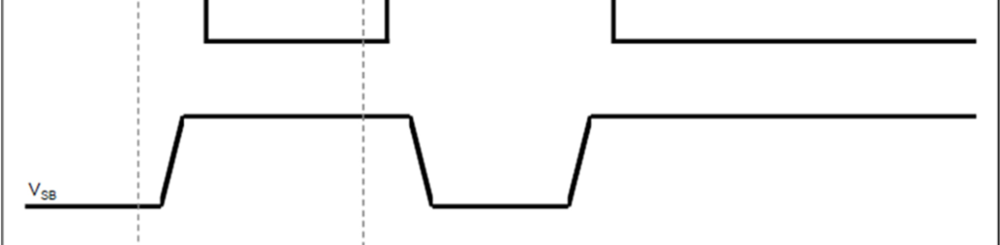

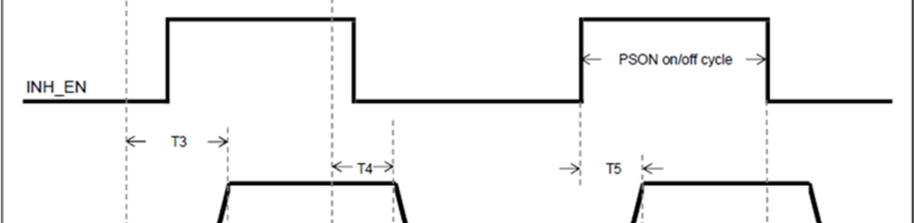

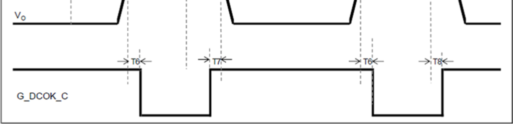

Rev.05.28.25_#3.2 advancedenergy.com 8

**LCM3000 Series**

**ELECTRICAL SPECIFICATIONS**

**LCM3000L Performance Curves**

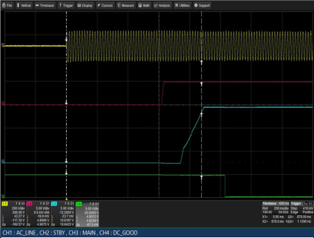

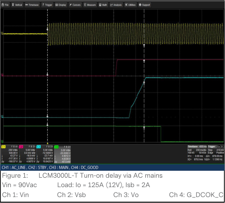

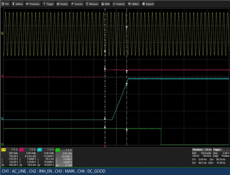

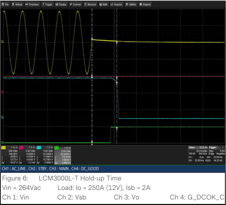

Rev.05.28.25_#3.2 advancedenergy.com 9

**LCM3000 Series**

**ELECTRICAL SPECIFICATIONS**

**LCM3000L Performance Curves**

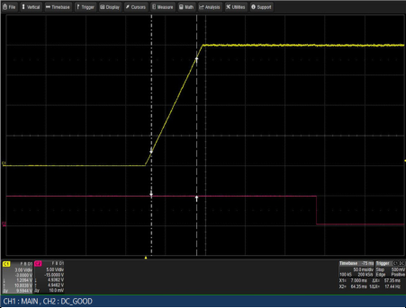

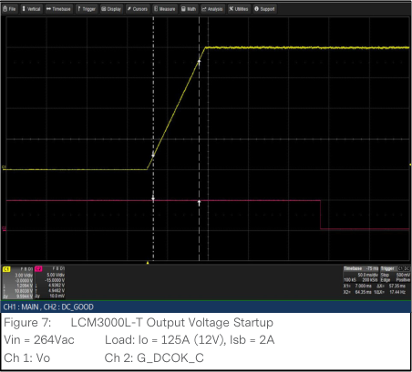

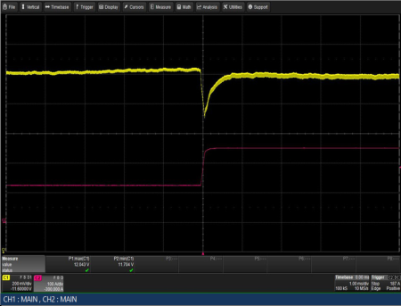

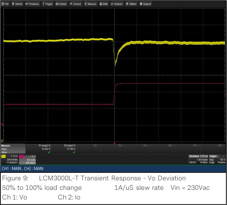

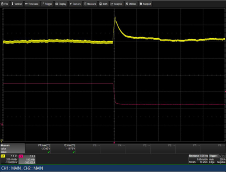

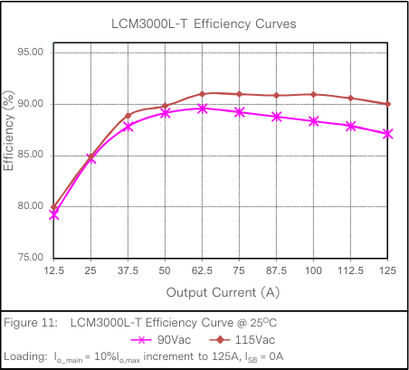

Rev.05.28.25_#3.2 advancedenergy.com 10

**LCM3000 Series**

**ELECTRICAL SPECIFICATIONS**

**LCM3000L Performance Curves**

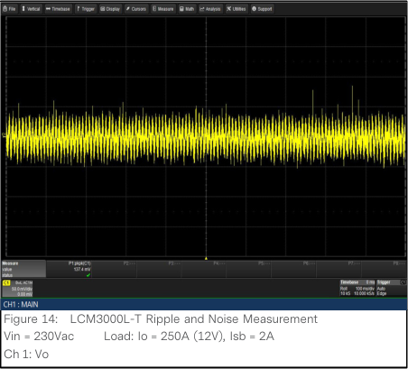

Note: Min 1A load is required to trim the output off-line via Remote Programming or Trimming Resistor. Trimming rate is 1V/sec.

Rev.05.28.25_#3.2 advancedenergy.com 11

**LCM3000 Series**

**ELECTRICAL SPECIFICATIONS**

**LCM30008 Performance Curves**

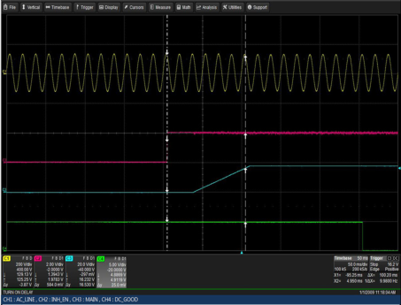

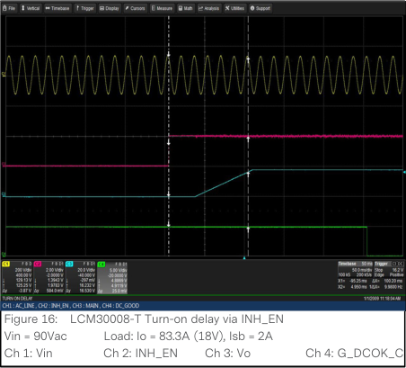

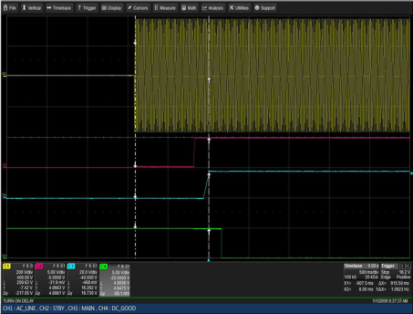

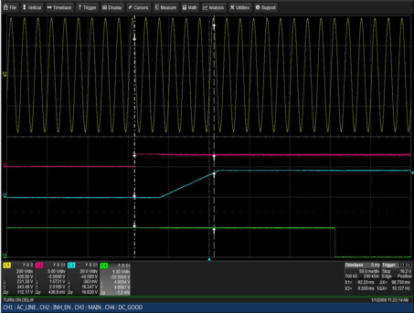

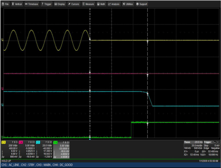

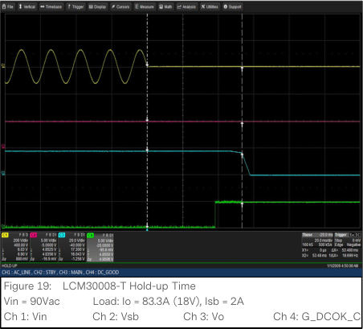

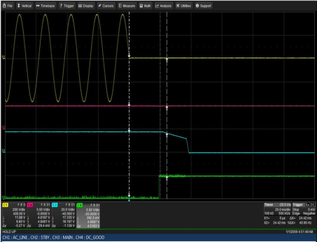

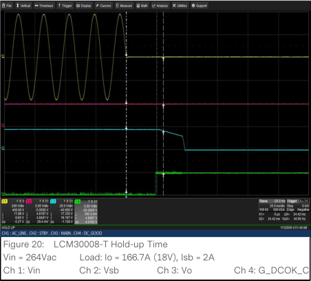

Rev.05.28.25_#3.2 advancedenergy.com 12

**LCM3000 Series**

**ELECTRICAL SPECIFICATIONS**

**LCM30008 Performance Curves**

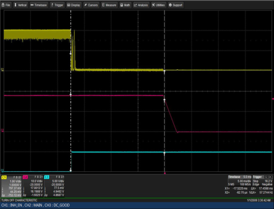

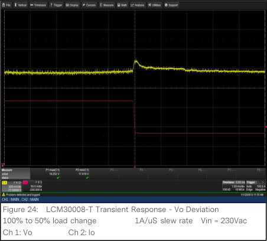

Rev.05.28.25_#3.2 advancedenergy.com 13

**LCM3000 Series**

**ELECTRICAL SPECIFICATIONS**

**LCM30008 Performance Curves**

Note: Min 1A load is required to trim the output off-line via Remote Programming or Trimming Resistor. Trimming rate is 1V/sec.

Rev.05.28.25_#3.2 advancedenergy.com 14

**LCM3000 Series**

**ELECTRICAL SPECIFICATIONS**

**LCM3000Q Performance Curves**

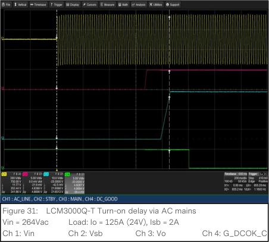

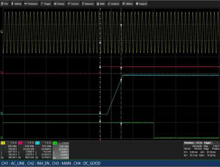

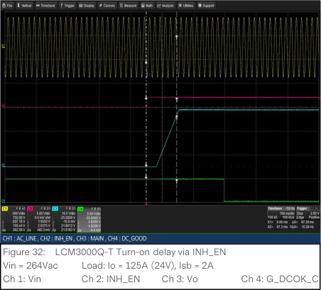

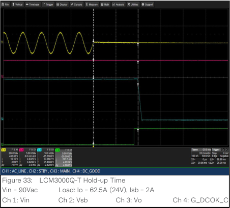

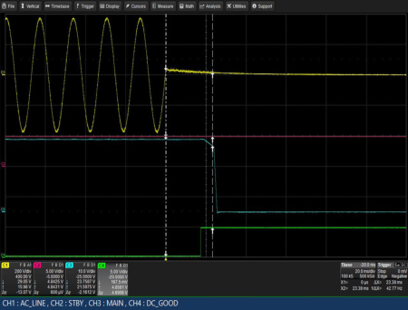

Rev.05.28.25_#3.2 advancedenergy.com 15

**LCM3000 Series**

**ELECTRICAL SPECIFICATIONS**

**LCM3000Q Performance Curves**

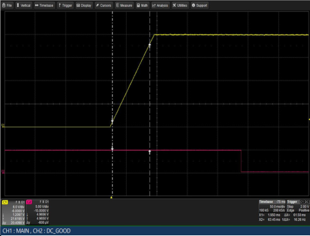

Rev.05.28.25_#3.2 advancedenergy.com 16

**LCM3000 Series**

**ELECTRICAL SPECIFICATIONS**

**LCM3000Q Performance Curves**

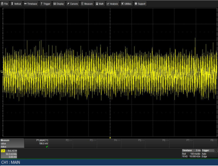

Note: Min 1A load is required to trim the output off-line via Remote Programming or Trimming Resistor. Trimming rate is 1V/sec.

Rev.05.28.25_#3.2 advancedenergy.com 17

**LCM3000 Series**

**ELECTRICAL SPECIFICATIONS**

**LCM3000U Performance Curves**

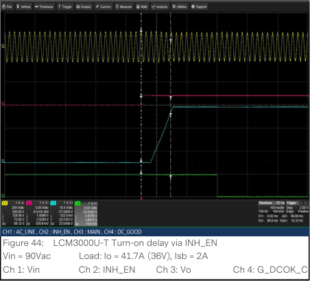

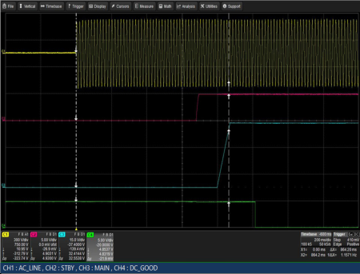

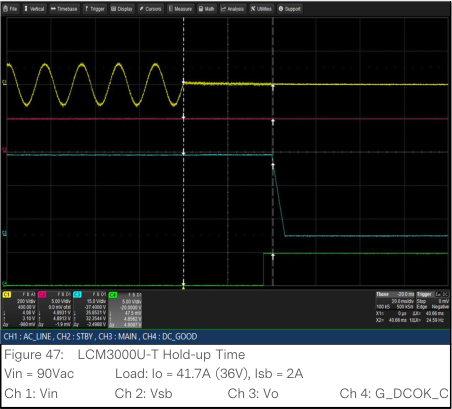

Rev.05.28.25_#3.2 advancedenergy.com 18

**LCM3000 Series**

**ELECTRICAL SPECIFICATIONS**

**LCM3000U Performance Curves**

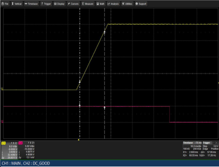

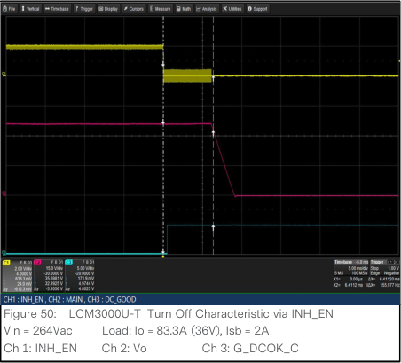

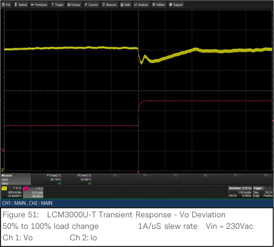

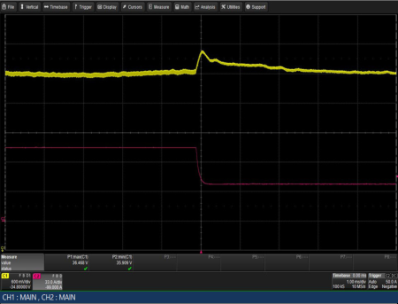

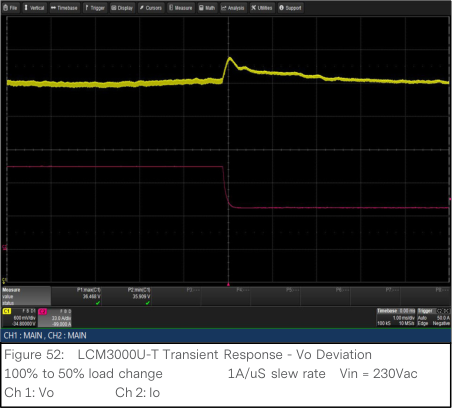

Rev.05.28.25_#3.2 advancedenergy.com 19

**LCM3000 Series**

**ELECTRICAL SPECIFICATIONS**

**LCM3000U Performance Curves**

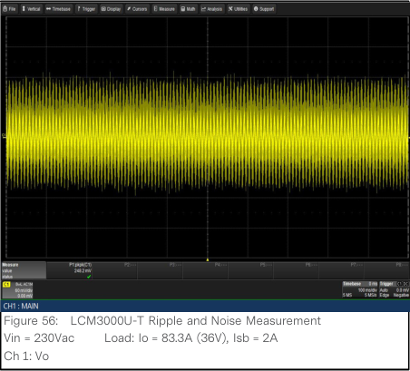

Note: Min 1A load is required to trim the output off-line via Remote Programming or Trimming Resistor. Trimming rate is 1V/sec .

Rev.05.28.25_#3.2 advancedenergy.com 20

**LCM3000 Series**

**ELECTRICAL SPECIFICATIONS**

**LCM3000W Performance Curves**

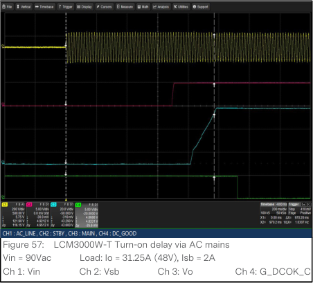

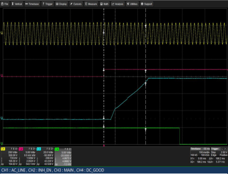

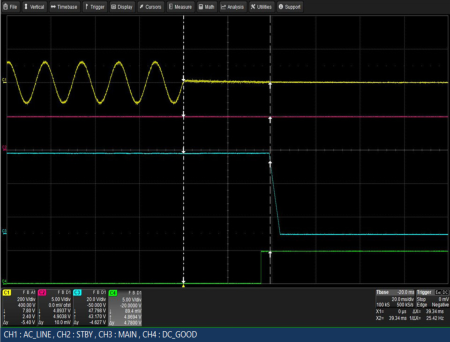

Rev.05.28.25_#3.2 advancedenergy.com 21

**LCM3000 Series**

**ELECTRICAL SPECIFICATIONS**

**LCM3000W Performance Curves**

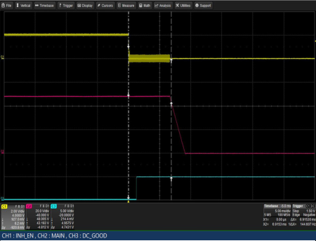

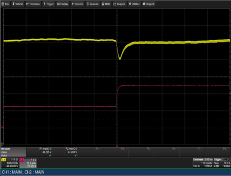

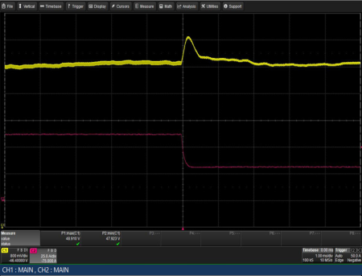

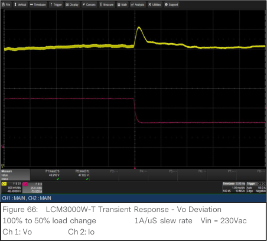

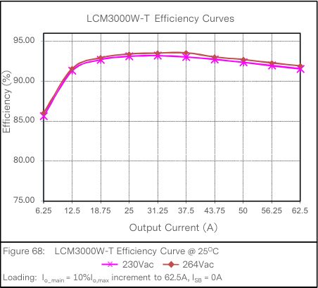

Rev.05.28.25_#3.2 advancedenergy.com 22

**LCM3000 Series**

**ELECTRICAL SPECIFICATIONS**

**LCM3000W Performance Curves**

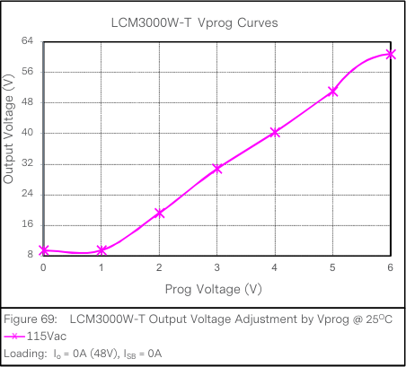

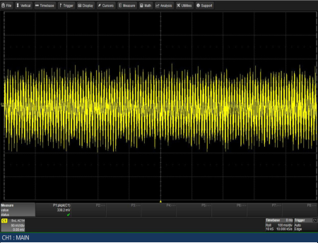

Note: Min 1A load is required to trim the output off-line via Remote Programming or Trimming Resistor. Trimming rate is 1V/sec.

Rev.05.28.25_#3.2 advancedenergy.com 23

**LCM3000 Series**

**ELECTRICAL SPECIFICATIONS**

**LCM30007 Performance Curves**

Rev.05.28.25_#3.2 advancedenergy.com 24

**LCM3000 Series**

**ELECTRICAL SPECIFICATIONS**

**LCM30007 Performance Curves**

Rev.05.28.25_#3.2 advancedenergy.com 25

**LCM3000 Series**

**ELECTRICAL SPECIFICATIONS**

**LCM30007 Performance Curves**

Note: Min 1A load is required to trim the output off-line via Remote Programming or Trimming Resistor. Trimming rate is 1V/sec.

Rev.05.28.25_#3.2 advancedenergy.com 26

**LCM3000 Series**

**ELECTRICAL SPECIFICATIONS**

**Protection Function Specifications**

**Input Fuse**

LCM3000 series is equipped with an internal non user serviceable 30A High Rupturing Capacity (HRC) 250 Vac fuse to IEC 127
for fault protection in both the Line and Neutral lines input.

**Over Voltage Protection (OVP)**

The power supply latches off during output overvoltage with the AC line recycled to reset the latch.

|Parameter|Min|Typ|Max|Unit|
|---|---|---|---|---|
|VO Output Overvoltage|110|/|130|% Vo|
|Standby Voltage Overvoltage|110|/|125|% Vo|

**Over Current Protection (OCP)**

LCM3000 series includes internal current limit circuitry to prevent damage in the event of overload or short circuit. Constant
current mode before output voltage falls below 35% of nominal. Recovery is automatic when the overload is removed. Bounce
period is 1 second.

Over current protection on 5V standby output will shutdown main DC output but any fault in main output will not affect standby
output.

|Parameter|Min|Typ|Max|Unit|
|---|---|---|---|---|
|VO Output Overcurrent|105|/|125|% IO,max|
|Standby Voltage Overcurrent|120|/|140|% IO,max|

**Short Circuit Protection (SCP)**

A short circuit is defined as less than 0.03 ohm resistance between the output terminals. All outputs will be protected against
short circuit to ground or other outputs. No damage will be resulted. In the event of short circuit, output will be in bouncing mode
with a recovery delay of 1Sec. Optional 5V standby, independent of the main output, will also be in bouncing mode once the fault
occurred.

**Over Temperature Protection (OTP)**

The power supply will be internally protected against over temperature conditions. When the OTP circuit is activated, the power
supply will shut off and will auto-recover once the OTP condition is gone. OTP trip-point at full Load is set at a nominal of 10 15 [O] C above safe operating area.

Rev.05.28.25_#3.2 advancedenergy.com 27

**MECHANICAL SPECIFICATIONS**

**Mechanical Outlines** (unit: mm)

**LCM3000 Series**

Rev.05.28.25_#3.2 advancedenergy.com 28

**LCM3000 Series**

**MECHANICAL SPECIFICATIONS**

**Mechanical Outlines** (unit: mm)

Note: For customer mounting, Dimension should be from external surface. Max screw protrusion will be 4.5mm (1.0mm chassis thickness)

Rev.05.28.25_#3.2 advancedenergy.com 29

**MECHANICAL SPECIFICATIONS**

**Connector Definitions**

AC Input Connector - SK1

– Earth Ground

L – Line

N – Neutral

Output Connector – SK3&SK4

SK3 – Main Output (Vo)

SK4 – Main Output Return

Output Connector – SK2

Pin 1 – A2

Pin 2 – -VPROG

Pin 3 – A1

Pin 4 – -VSENSE

Pin 5 – -ISHARE

Pin 6 – A0

Pin 7 – SDA1

Pin 8 – +VPROG

Pin 9 – SCL1

Pin 10 – +VSENSE

Pin 11 – 5VSB

Pin 12 – GND

Pin 13 – 5VSB

Pin 14 – G_DCOK_C

Pin 15 – GPIOA6

Pin 16 – G_DCOK_E

Pin 17 – GND

Pin 18 – G_ACOK_C

Pin 19 – INH_EN

Pin 20 – G_ACOK_E

**LCM3000 Series**

SK1      SK3     SK4    SK2

Rev.05.28.25_#3.2 advancedenergy.com 30

**MECHANICAL SPECIFICATIONS**

**Potentiometer Location**

**Label Location**

**LCM3000 Series**

Rev.05.28.25_#3.2 advancedenergy.com 31

**LCM3000 Series**

**MECHANICAL SPECIFICATIONS**

**Power / Signal Mating Connectors and Pin Types**

|Table 5. Mating Connectors for LCM3000 Series|Col2|Col3|
|---|---|---|
|**Reference**|**On Power Supply**|**Mating Connector or Equivalent**|
|AC Input Connector|451-004155-0000 (TERM-BLOCK DT- 7C-B14W-03)|M4 Screw|
|SK2|CI0120P1HD0-LF|LANDWIN (LWE PN: 2050S) Housing (LWE PN: 2053T) Contact CVILUX (CX PN: CI0120SD000) Housing (CX PN: CI01TD21PE0) Contact|
|SK3, SK4|500-008156-0004 (BBAR O/P LCM3000)|Clearance hole diameterφ8.5|

Rev.05.28.25_#3.2 advancedenergy.com 32

**MECHANICAL SPECIFICATIONS**

**LED Indicator Definitions**

ACOK DCOK/FAIL

**LCM3000 Series**

Two user-friendly LEDs for status and diagnostics
show status of input power, output power and alarm
condition valuable troubleshooting aid to reduce
system downtime.

|Conditions|LED Status|Col3|
|---|---|---|
|**Conditions**|**ACOK** **LED**|**DCOK/FAIL LED**|
|AC present / Output On|Green|Green|
|No AC power to PSU|OFF|OFF|
|Standby mode/main output off|Green|OFF|
|Power supply failure|Green|OFF|

Rev.05.28.25_#3.2 advancedenergy.com 33

**LCM3000 Series**

**MECHANICAL SPECIFICATIONS**

**Weight**

The LCM3000 series weight is 7.718Ibs.(3.5kg) maximum.

Rev.05.28.25_#3.2 advancedenergy.com 34

**LCM3000 Series**

**ELECTRICAL SPECIFICATIONS**

**EMC Immunity**

The LCM3000 series are designed to meet the following EMC immunity specifications. **[NVIRONMENTAL SPECIFICATIONS]**

**ELECTRICAL SPECIFICATIONS** **[NVIRONMENTAL SPECIFICATIONS]**

**EMC Immunity**

|Table 6. Environmental Specifications|Col2|
|---|---|
|**Document**|**Description**|
|EN55032|Conducted and radiated EMI limits|
|EN61000-3-2 harmonic|EMC limits for harmonic current emissions|
|EN61000-3-3|Voltage fluctuations|
|EN61000-4-2|Electromagnetic Compatibility (EMC) - Testing and measurement techniques - Electrostatic discharge immunity test. +/-15KV air, +/-8KV contact discharge, Criteria B|
|EN61000-4-3|Electromagnetic Compatibility (EMC) - Testing and measurement techniques, Radiated, radio-frequency, electromagnetic field immunity test. 10V/m, Criteria A|
|EN61000-4-4|Electromagnetic Compatibility (EMC) - Testing and measurement techniques, Electrical Fast Transient/Burst Immunity Test. 2KV for AC power port, Criteria B|
|EN61000-4-5|Electromagnetic Compatibility (EMC) - Testing and measurement techniques - 4KV common mode and 2KV differential mode for AC ports, Criteria B|
|EN61000-4-6|Conducted RFI, 10Vrms (Designed to meet at system level)|
|EN61000-4-8|Power Freq Magnetic, Level 3|
|EN61000-4-11|Electromagnetic Compatibility (EMC) - Testing and measurement techniques : Voltage Dips and Interruptions: 30% reduction for 500mS- Criteria B>95% reduction for 10mS, Criteria A, >95% reduction for 5000mS, Criteria C|
|EN55024: 1998|Information Technology Equipment - Immunity Characteristics, Limits and Method of Measurement|

Rev.05.28.25_#3.2 advancedenergy.com 35

**LCM3000 Series**

**ELECTRICAL SPECIFICATIONS**

**Safety Certifications**

The LCM3000 series are intended for inclusion in other equipment and the installer must ensure that it is in compliance
with all the requirements of the end application. This product is only for inclusion by professional installers within other
equipment and must not be operated as a standard alone product. **[NVIRONMENTAL SPECIFICATIONS]**

**ELECTRICAL SPECIFICATIONS** **[NVIRONMENTAL SPECIFICATIONS]**

**Safety Certifications**

|Table 7. Safety Certifications for LCM3000 Series Power Supply System|Col2|Col3|
|---|---|---|
|**Standard**|**Agency**|**Description**|
|UL/CSA62368-1 ANSI/ AAMI ES60601-1|UL + CSA|US and Canada Requirements|
|EN62368-1 and EN60601-1|TUV|European Requirements|
|IEC60950-1, IEC60601-1, IEC62368-1|CB Scheme|International Electrotechnical Commission|
|CE Mark||European Requirements|
|UKCA Mark||UK Requirements|

Rev.05.28.25_#3.2 advancedenergy.com 36

**LCM3000 Series**

**ELECTRICAL SPECIFICATIONS**

**EMI Emissions**

inside a metal box, tested at 3000W using resistive load with cooling fan.

**Conducted Emissions**

system ground and can be broadband in nature.

Conducted EMI emissions specifications of the LCM3000 series: **[NVIRONMENTAL SPECIFICATIONS]**

**ELECTRICAL SPECIFICATIONS** **[NVIRONMENTAL SPECIFICATIONS]**

**EMI Emissions**

The LCM3000 series has been designed to comply with the Class A limits of EMI requirements of EN55022 (FCC Part 15)
and CISPR 32 (EN55032) for emissions and relevant sections of EN61000 (IEC 61000) for immunity. The unit is enclosed
inside a metal box, tested at 3000W using resistive load with cooling fan.

**Conducted Emissions**

The applicable standard for conducted emissions is EN55032 (FCC Part 15). Conducted noise can appear as both
differential mode and common mode noise currents. Differential mode noise is measured between the two input lines,
with the major components occurring at the supply fundamental switching frequency and its harmonics. Common mode
noise, a contributor to both radiated emissions and input conducted emissions, is measured between the input lines and
system ground and can be broadband in nature.

The LCM3000 series have internal EMI filters to

ensure the convertors’ conducted EMI levels
comply with EN55022 (FCC Part 15) Class A.

The EMI measurements are performed with
resistive loads at maximum rated loading Sample
of EN55022 Conducted EMI Measurement at

110Vac input.

Note:  Red Line refers to Artesyn Quasi Peak
margin, which is 6dB below the CISPR
international limit. Pink Line refers to the

Artesyn Average margin, which is 6dB
below the CISPR international limit.

|Parameter|Model|Symbol|Min|Typ|Max|Unit|
|---|---|---|---|---|---|---|
|FCC Part 15, class A|All|Margin|6|-|-|dB|
|CISPR 32 (EN55032), class A|All|Margin|6|-|-|dB|

Rev.05.28.25_#3.2 advancedenergy.com 37

**LCM3000 Series**

**ELECTRICAL SPECIFICATIONS**

**Radiated Emissions**

Unlike conducted EMI, radiated EMI performance in a system environment may differ drastically from that in a stand-alone
power supply. The shielding effect provided by the system enclosure may bring the EMI level from Class A to Class B. It is
thus recommended that radiated EMI be evaluated in a system environment. The applicable standard is EN55022 Class A
(FCC Part 15). Testing ac-dc convertors as a stand-alone component to the exact requirements of EN55022 can be
difficult, because the standard calls for 1m leads to be attached to the input and outputs and aligned such as to maximize
the disturbance. In such a set-up, it is possible to form a perfect dipole antenna that very few AC-DC convertors could
pass. However, the standard also states that an attempt should be made to maximize the disturbance consistent with the
typical application by varying the configuration of the test sample. **[NVIRONMENTAL SPECIFICATIONS]**

**ELECTRICAL SPECIFICATIONS** **[NVIRONMENTAL SPECIFICATIONS]**

**Radiated Emissions**

Rev.05.28.25_#3.2 advancedenergy.com 38

**LCM3000 Series**

**ELECTRICAL SPECIFICATIONS**

**Operating Temperature**

The LCM3000 series maximum output power (3000W) can be loaded up to an ambient temperature of +50

Only 50 % of the maximum output power can be loaded at ambient temperature of +70
nominal output power starts from +50 [O]
steady state values requires 5 minute warm up for -20 [O] C to -40 [O] C operation.

**Output Power vs Operating Temperature**

**Forced Air Cooling**

the end of the power supply.

The cooling fan is a variable speed fan. Fan will be smart based on internal temperature. **[NVIRONMENTAL SPECIFICATIONS]**

**ELECTRICAL SPECIFICATIONS** **[NVIRONMENTAL SPECIFICATIONS]**

**Operating Temperature**

The LCM3000 series maximum output power (3000W) can be loaded up to an ambient temperature of +50 [O] C.

Only 50 % of the maximum output power can be loaded at ambient temperature of +70 [O] C. Linear derating to 50%
nominal output power starts from +50 [O] C. The elapsed time between the application of input power and the attainment
steady state values requires 5 minute warm up for -20 [O] C to -40 [O] C operation.

**Output Power vs Operating Temperature**

**Forced Air Cooling**

The LCM3000 series power supplies included internal cooling fans as part of the power supply assembly to provide
forced air-cooling to maintain and control temperature of devices and ambient. The standard direction of airflow is from
the end of the power supply.

Rev.05.28.25_#3.2 advancedenergy.com 39

**LCM3000 Series**

**ELECTRICAL SPECIFICATIONS**

**Storage and Shipping Temperature**

to 95% non-condensing.

**Altitude**

**Humidity**

**Vibration**

The LCM3000 series will pass the following vibration specifications:

Non-Operating Random Vibration

Operating Random Vibration **[NVIRONMENTAL SPECIFICATIONS]**

**ELECTRICAL SPECIFICATIONS** **[NVIRONMENTAL SPECIFICATIONS]**

**Storage and Shipping Temperature**

The LCM3000 series can be stored or shipped at temperatures between -40 [O] C to +85 [O] C and relative humidity from 20%
to 95% non-condensing.

**Altitude**

The LCM3000 series will operate within specifications at altitudes up to 16405 feet (5000 meters) above sea level. The power
supply will not be damaged when stored at altitudes of up to 5000 meters above sea level.

**Humidity**

The LCM3000 series will operate within specifications when subjected to a relative humidity from 20% to 90% non-condensing.
The LCM3000 series can be stored in a relative humidity from 10% to 95% non-condensing.

**Vibration**

The LCM3000 series will pass the following vibration specifications:

Non-Operating Random Vibration

|Acceleration|1.0|Col3|gRMS|
|---|---|---|---|
|**Frequency Range**|5 - 500|5 - 500|Hz|
|**Duration**|30|30|Mins|
|**Direction**|3 mutually perpendicular axis|3 mutually perpendicular axis|3 mutually perpendicular axis|
|**PSD Profile**|**FREQ (Hz)**|**SLOPE (db/oct)**|**PSD (g²/Hz)**|
|**PSD Profile**|10|/|0.005|
|**PSD Profile**|20|/|0.01|
|**PSD Profile**|80|/|0.04|
|**PSD Profile**|350|/|0.04|
|**PSD Profile**|2000|/|0.007|

|Acceleration|1.0|Col3|gRMS|
|---|---|---|---|
|**Frequency Range**|5 – 500|5 – 500|Hz|
|**Duration**|30|30|Mins|
|**Direction**|3 mutually perpendicular axis|3 mutually perpendicular axis|3 mutually perpendicular axis|
|**PSD Profile**|**FREQ (Hz)**|**SLOPE (db/oct)**|**PSD (g²/Hz)**|
|**PSD Profile**|10|/|0.04|
|**PSD Profile**|350|/|0.04|
|**PSD Profile**|500|/|0.0198|

Rev.05.28.25_#3.2 advancedenergy.com 40

**LCM3000 Series**

**ELECTRICAL SPECIFICATIONS**

**Shock**

Non-Operating Half-Sine Shock

Operating Half-Sine Shock **[NVIRONMENTAL SPECIFICATIONS]**

**ELECTRICAL SPECIFICATIONS** **[NVIRONMENTAL SPECIFICATIONS]**

**Shock**

The LCM3000 series power supply will pass the following shock specifications:

Non-Operating Half-Sine Shock

|Acceleration|30|G|
|---|---|---|
|**Duration**|36|mSec|
|**Pulse**|trapezoidal|trapezoidal|
|**Number of Shock**|3 shock on each of 6 faces|3 shock on each of 6 faces|

|Acceleration|40|G|
|---|---|---|
|**Duration**|6|mSec|
|**Pulse**|Half-Sine|Half-Sine|
|**Number of Shock**|3 shocks in each of 6 faces|3 shocks in each of 6 faces|

Rev.05.28.25_#3.2 advancedenergy.com 41

**LCM3000 Series**

**ELECTRICAL SPECIFICATIONSPOWE ANDCONTROL SGNAL DESCRIPTIONS**

**AC Input Connector**

This connector supplies the AC Mains to the LCM3000 series power supply.

SK1 – Earth Ground

SK1 – Line

SK1 – Neutral

**Output Connectors- SK3&SK4**

These pins provide the main output for the LCM3000 series. The + Main Output (V O ) and the Main Output Return pins are the
positive and negative rails, respectively, of the V O main output of the LCM3000 series power supply. The Main Output (V O ) is
electrically isolated from the power supply chassis.

SK3 – +Main Output (V O )
SK4 – Main Output Return

**Control Signals - SK2**

The LCM3000 series SK2 contains 20 pins control signal header providing analogy control interface, standby power and i [2] C
interface.

**A0, A1, A2 -** **(Pin 6, Pin3, Pin1)**

Please refer to “Communication Pins Descriptions” section.

**-VPROG, +VPROG -** **(Pin2, Pin8)**

Positive and return connection of external supply for Margin Programming. The Power supplies will have a “margin” pin which will
accept a 1-6VDC signal referenced to a floating return that will program the output the entire adjustment range. Applying voltage
greater than 6V may result to damage of PSU internal circuit.

**-Vsense, +Vsense -** **(Pin 4, Pin10)**

This remote sense circuit will be designed to compensate for a power path drop around the entire loop of 0.5 volt. These pins
should be connected as close to the loading as possible, If left open, the power supply will regulate the voltage at its output
terminals but the voltage level at the load may go lower than the guaranteed spec.

**ISHARE -** **(Pin 5)**

The main output will have active load sharing. The output will share within 10% at full load. All current sharing functions are
implemented internal to the power supply by making use of the ISHARE signal. The system connects the ISHARE lines between
the power supplies. The supplies must be able to load share with up to 10 power supplies in parallel.

**SDA1, SCL1, GND -** **(Pin 7, Pin9, Pin17)**

Please refer to “Communication Bus Descriptions” section.

**5VSB, GND -** **(Pin11, Pin12, Pin13)**

The LCM3000 series provides a regulated 5VSB output voltage to power critical circuitry that must remain active regardless of the
on/off status of the power supply’s main output. The 5VSB voltage is available whenever a valid AC input voltage is applied to the
unit.

Rev.05.28.25_#3.2 advancedenergy.com 42

**LCM3000 Series**

**ELECTRICAL SPECIFICATIONSPOWE ANDCONTROL SGNAL DESCRIPTIONS**

**G_DCOK_C, G_DCOK_E -** **(Pin14, Pin16)**

G_DCOK_C is a power good signal and could be driven “low” by the power supply to indicate that both the outputs are within the
regulation limits of the power supply. When any output voltage falls below regulation limits or when AC power has been removed
for a time sufficiently long so that power supply operation is no longer guaranteed, G_DCOK_C could be de-asserted to a high
state. Connect 4.7K to 10K resistor on G_DCOK_C to PSU’s 5VSB.

Power supply side Customer system side

**100ohm**

**GPIOA6 -** **(Pin15)**

EEPROM Write Protect Allows Read/Write operation when connected to Gnd. When GPIOA6 pin is connected to 3.3V, the write
protection is enabled.

**G_ACOK_C, G_ACOK_E -** **(Pin18, Pin20)**

G-ACOK_C signal is used to indicate presence of AC input to the power supply. A logic “Low” level on this signal shall indicate
AC input to the power supply is present. A Logic “High” on this signal shall indicate a loss of AC input to the power supply.
Connect 4.7K to 10K resistor on G_ACOK_C to 5VSB.

Power supply side Customer system side

**100ohm**

**INH_EN -** **(Pin19)**

0.0 - 0.5V contact closure main output is OFF. Left open will enable the Main output.

Rev.05.28.25_#3.2 advancedenergy.com 43

**LCM3000 Series**

**COMMUNICATION BUS DESCRIPTIONSELECTRICAL SPECIFICATIONS**

**I** **[2]** **C Bus Signals**

The LCM3000 series contains enhanced monitor and control functions implemented via the I [2] C bus. The LCM3000 series I [2] C
functionality (PMBus [TM] and FRU data) can be accessed via the output connector control signals. The communication bus is
powered either by the internal 3.3V supply or from an external power source connected to the Standby Output (ie: accessing an
unpowered power supply as long as the Standby Output of another power supply connected in parallel is on).

If units are connected in parallel or in redundant mode, the Standby Outputs must be connected together in the system.
Otherwise, the I [2] C bus will not work properly when a unit is inserted into the system without the AC source connected.

Note: PMBus [TM] functionality can be accessed only when the PSU is powered-up. Guaranteed communication I [2] C speed is
100KHz.

**SDA1, SCL1 (I** **[2]** **C Data and Clock Signals) -** **(pin7, pin 9)**

I [2] C serial data and clock bus - these pins are internally pulled up to internal 3.3V supply with a 4.7K ohm resistor. These pins
recommended to be pulled-up in the system by an 2.2K ohm resistor to the 3.3V external voltage.

**A0, A1, A2 (I2C Address BIT 0, BIT1, BIT2 Signals) -** **(pin6, pin3, pin1)**

These three input pins are the address lines A0, A1 and A2 to indicate the slot position the power supply occupies in the power
bay and define the power supply addresses for FRU data and PMBus [TM] data communication. This allows the system to assign
different addresses for each power supply. During I [2] C communication between system and power supplies, the system will be the
master and power supplies will be slave.

They are internally pulled up to internal 3.3V supply with a 2.7K ohm resistor.

**I** **[2]** **C Bus Communication Interval**

The interval between two consecutive I [2] C communications to the power supply should be at least 50ms to ensure proper
monitoring functionality.

**I** **[2]** **C Bus Signal Integrity**

The noise on the I [2] C bus (SDA, SCL lines) due to the power supply will be less than 450mV peak-to-peak. This noise
measurement should be made with an oscilloscope bandwidth limited to 100MHz. Measurements should be make at the power
supply output connector with 2.2K ohm resistors pulled up to Standby Output and 20pf ceramic capacitors to standby Output
Return.

The noise on the address lines A0 and A1 will be less than 100mV peak-to-peak. This noise measurement should be made at the
power supply output connector.

Rev.05.28.25_#3.2 advancedenergy.com 44

**LCM3000 Series**

**COMMUNICATION BUS DESCRIPTIONSELECTRICAL SPECIFICATIONS**

**I** **[2]** **C Bus Internal Implementation, Pull-ups and Bus Capacitances**

**SYSTEM**

**POWER SUPPLY SIDE**

**I** **[2]** **C Bus - Recommended external pull-ups**

Electrical and interface specifications of I [2] C signals (referenced to standby output return pin, unless otherwise indicated):

|Parameter|Condition|Symbol|Min|Type|Max|Unit|
|---|---|---|---|---|---|---|
|SDA, SCL Internal Pull-up Resistor||Rint|-|4.7|-|Kohm|
|SDA, SCL Internal Bus Capacitance||Cint|-|0|-|pF|
|Recommended External Pull-up Resistor|1 to 8 PSU|Rext|-|2.2|-|Kohm|

Rev.05.28.25_#3.2 advancedenergy.com 45

**LCM3000 Series**

**COMMUNICATION BUS DESCRIPTIONSELECTRICAL SPECIFICATIONS**

**Device Addressing**

Slave device address is configurable via address pins. Base address is 0xB0. FRU access requires another address and is
configurable as well via the address pins. Base address is 0xA0. Below is the table of the possible addresses that can be used via
the address pin configuration.

|PSU Slot|Col2|Col3|PMBus Write Address|PMBus Read Address|FRU Write Address|FRU Read Address|
|---|---|---|---|---|---|---|
|**A2**|**A1**|**A0**|**A0**|**A0**|**A0**|**A0**|
|1|1|1|0xBE|0xBF|0xAE|0xAF|
|1|1|0|0xBC|0xBD|0xAC|0xAD|
|1|0|1|0xBA|0xBB|0xAA|0xAB|
|1|0|0|0xB8|0xB9|0xA8|0xA9|
|0|1|1|0xB6|0xB7|0xA6|0xA7|
|0|1|0|0xB4|0xB5|0xA4|0xA5|
|0|0|1|0xB2|0xB3|0xA2|0xA3|
|0|0|0|0xB0|0xB1|0xA0|0xA1|

Note: the address pins are in high state initially. Base I2C address is BE.

Rev.05.28.25_#3.2 advancedenergy.com 46

**LCM3000 Series**

**COMMUNICATION BUS DESCRIPTIONSELECTRICAL SPECIFICATIONS**

**Logic Levels**

LCM3000 series power supply I [2] C communication bus will respond to logic levels as per below:

Logic High: 3.3V nominal (Spec is 2.1V to 5.5V)**
Logic Low: 500mV nominal (Spec is 800mV max)**

**Note: Artesyn 73-769-001 I [2] C adapter was used.

**Timings**

|Parameter|Symbol|Standard-Mode Specs|Col4|Actual Measured|Col6|Unit|
|---|---|---|---|---|---|---|
|**Parameter**|**Symbol**|**Min**|**Max**|**Max**|**Max**|**Max**|
|SCL clock frequency|fSCL|10|100|99.62|99.62|KHz|
|Hold time (repeated) START condition|tHD;STA|4.0|-|4.67|4.67|uS|
|LOW period of SCL clock|tLOW|4.7|-|4.96|4.96|uS|
|HIGH period of SCL clock|tHIGH|4.0|-|4.28|4.28|uS|
|Setup time for repeated START condition|tSU;STA|4.7|-|4.70|4.70|uS|
|Data hold time|tHD;DAT|0|3.45|0.20|0.20|uS|
|Data setup time|tSU;DAT|250|-|4480|4480|nS|
|Rise time|tr|-|1000|SCL = 430|SCL = 368|nS|
|Fall time|tf|-|300|SCL = 230|SCL = 70|nS|
|Setup time for STOP condition|tSU;STO|4.0|-|4.93|4.93|uS|
|Bus free time between a STOP and START condition|tBUF|4.7|-|9.51***|9.51***|uS|

***Note: Artesyn 73-769-001 I [2] C adapter (USB-to-I2C) and Universal PMBus [TM ] GUI software was used.

Rev.05.28.25_#3.2 advancedenergy.com 47

**LCM3000 Series**

**COMMUNICATION BUS DESCRIPTIONSELECTRICAL SPECIFICATIONS**

**I** **[2]** **C Synchronization**

The LCM3000 series power supply might apply clock stretching. An addressed slave power supply may hold the clock line (SCL)
low after receiving (or sending) a byte, indicating that it is not yet ready to process more data. The system master that is
communicating with the power supply will attempt to raise the clock to transfer the next bit, but must verify that the clock line was
actually raised. If the power supply is clock stretching, the clock line will still be low (because the connections are open-drain).

The maximum time-out condition for clock stretching for LCM3000 series is 100 milliseconds.

Rev.05.28.25_#3.2 advancedenergy.com 48

**LCM3000 Series**

**PMBusELECTRICAL SPECIFICATIONS** **[TM]** **SPECIFICATIONS**

The LCM3000 series is compliant with the industry standard PMBus [TM] protocol for monitoring and control of the power supply via
the I [2] C interface port.

**LCM3000 Series PMBus** **[TM]** **General Instructions**

**Equipment Setup**

The following is typical I [2] C communication setup:

**PMBus** **[TM]** **Writing Instructions**

When writing to any PMBus [TM] R/W registers, ALWAYS do the following:

Disable Write Protect (command 10h) by writing any of the following accordingly:

Levels: 00h - Enable writing to all writeable commends

20h - Disables write except 10h, 01h, 00h, 02h and 21h commands

40h - Disables write except 10h, 01h, and 00h commends

80h - Disable write except 0x00h

To save changes on the PMBus [TM] Command List:

Use send byte command: 15h STORE_USER_ALL

Wait for 5 seconds, turn-off the PSU, wait for another 5 seconds before turning it on.

Rev.05.28.25_#3.2 advancedenergy.com 49

**LCM3000 Series**

**PMBusELECTRICAL SPECIFICATIONS** **[TM]** **SPECIFICATIONS**

The LCM3000L-T Series Supported PMBus [TM] Command List:

|Command Code|Command Name|Default Value|Access Type|Data Bytes|Data Format|Description|
|---|---|---|---|---|---|---|
|00h|PAGE|-|R|1|H||
|01h|OPERATION|80|R/W|1|B|Used to turn the unit ON/OFF in conjunction with the input INH_EN pin. Write 40h to turn off PSU, 80h to turn on the PSU|
|02h|ON_OFF_CONFIG|1E|R|1|B|Configures the combination of INH_EN pin and serial communication commands needed to turn the unit ON/OFF|
|03h|CLEAR_FAULTS|-|S|0|N/A||
|10h|WRITE_PROTECT|80|R/W|1|B|Used to Control Writing to the PMBus Device 80h - Disables write 40h - Disables write except 00h, 01h 00 - Enables write to all writeable commands|
|15h|STORE_USER_ALL|-|S|0|N/A|Copies the Operating memory table to the matching USER non- volatile memory|
|1Bh|SMBALERT_MASK|0|BR/W|1/1 (R) 2 (W)|B|BMC - no alert|
|20h|VOUT_MODE|18|R|1|B|Specifies the mode and parameters of Output Voltage related Data Formats|
|21h|VPROG|12|R/W|2|Linear|Digital Voltage Programming|
|35h|VIN_ON|90|R|2|Linear||
|36h|VIN_OFF|85|R|2|Linear||
|3Bh|FAN_COMMAND_1|0|R/W|2|Linear|Read and write Fan rotation.|
|40h|VOUT_OV_FAULT_LIMIT|16.199|R|2|Linear|Sets Output Over voltage threshold (16.199V)|
|41h|VOUT_OV_FAULT_RESPON SE|80|R|1|B||
|42h|VOUT_OV_WARN_LIMIT|13.199|R|2|Linear|Sets Over-voltage Warning threshold (13.199V)|
|45h|VOUT_UV_FAULT_RESPON SE|78|R|1|B||
|46h|IOUT_OC_FAULT_LIMIT|322.5|R|2|Linear|Sets the Over current threshold in Amps (322.5A )|
|47h|IOUT_OC_FAULT_RESPON SE|78|R|1|B||
|4Fh|OT_FAULT_LIMIT|112|R|2|Linear|Secondary ambient temperature Fault threshold, in degree C (112degC)|
|50h|OT_FAULT_RESPONSE|C0|R|1|B||
|51h|OT_WARN_LIMIT|108|R|2|Linear|Secondary ambient temperature warning threshold, in degree C. Operating limit (108degC)|
|6Ah|POUT_OP_WARN_LIMT|3452|R|2|Linear||

Rev.05.28.25_#3.2 advancedenergy.com 50

**LCM3000 Series**

**PMBusELECTRICAL SPECIFICATIONS** **[TM]** **SPECIFICATIONS**

The LCM3000L-T Series Supported PMBus [TM] Command List:

|Command Code|Command Name|Default Value|Access Type|Data Bytes|Data Format|Description|
|---|---|---|---|---|---|---|
|78h|STATUS_BYTE b7 - BUSY b6 - OFF b5 - VOUT_OV_FAULT b4 - IOUT_OC_FAULT b3 - VIN_UV_FAULT b2 - TEMPERATURE b1 - CML b0 - NONE OF THE ABOVE|00|R|1|B|Returns the summary of critical faults|
|78h|STATUS_BYTE b7 - BUSY b6 - OFF b5 - VOUT_OV_FAULT b4 - IOUT_OC_FAULT b3 - VIN_UV_FAULT b2 - TEMPERATURE b1 - CML b0 - NONE OF THE ABOVE|||||Not Supported|
|78h|STATUS_BYTE b7 - BUSY b6 - OFF b5 - VOUT_OV_FAULT b4 - IOUT_OC_FAULT b3 - VIN_UV_FAULT b2 - TEMPERATURE b1 - CML b0 - NONE OF THE ABOVE|||||Unit is OFF|
|78h|STATUS_BYTE b7 - BUSY b6 - OFF b5 - VOUT_OV_FAULT b4 - IOUT_OC_FAULT b3 - VIN_UV_FAULT b2 - TEMPERATURE b1 - CML b0 - NONE OF THE ABOVE|||||Output over-voltage fault has occurred, will only be cleared when latching condition is removed|
|78h|STATUS_BYTE b7 - BUSY b6 - OFF b5 - VOUT_OV_FAULT b4 - IOUT_OC_FAULT b3 - VIN_UV_FAULT b2 - TEMPERATURE b1 - CML b0 - NONE OF THE ABOVE|||||Not Supported|
|78h|STATUS_BYTE b7 - BUSY b6 - OFF b5 - VOUT_OV_FAULT b4 - IOUT_OC_FAULT b3 - VIN_UV_FAULT b2 - TEMPERATURE b1 - CML b0 - NONE OF THE ABOVE|||||Not Supported|
|78h|STATUS_BYTE b7 - BUSY b6 - OFF b5 - VOUT_OV_FAULT b4 - IOUT_OC_FAULT b3 - VIN_UV_FAULT b2 - TEMPERATURE b1 - CML b0 - NONE OF THE ABOVE|||||A temperature fault or warning has occurred, will only be cleared when condition is removed|
|78h|STATUS_BYTE b7 - BUSY b6 - OFF b5 - VOUT_OV_FAULT b4 - IOUT_OC_FAULT b3 - VIN_UV_FAULT b2 - TEMPERATURE b1 - CML b0 - NONE OF THE ABOVE|||||A communication, memory or logic fault has occurred|
|78h|STATUS_BYTE b7 - BUSY b6 - OFF b5 - VOUT_OV_FAULT b4 - IOUT_OC_FAULT b3 - VIN_UV_FAULT b2 - TEMPERATURE b1 - CML b0 - NONE OF THE ABOVE|||||Not Supported|
|79h|STATUS_WORD b15 - VOUT b14 - IOUT/POUT b13 - INPUT b12 - MFR_SPECIFIC b11 - POWER_GOOD# b10 - FANS b9 - OTHERS b8 - UKNOWN b7 - BUSY b6 - OFF b5 - VOUT_OV _FAULT b4 - IOUT_OC_FAULT b3 - VIN_UV_FAULT b2 - TEMPERATURE b1 - CML B0 - NONE_OF_THE_ABOVE|0000|R|2|B|Summary of units Fault and warning status|
|79h|STATUS_WORD b15 - VOUT b14 - IOUT/POUT b13 - INPUT b12 - MFR_SPECIFIC b11 - POWER_GOOD# b10 - FANS b9 - OTHERS b8 - UKNOWN b7 - BUSY b6 - OFF b5 - VOUT_OV _FAULT b4 - IOUT_OC_FAULT b3 - VIN_UV_FAULT b2 - TEMPERATURE b1 - CML B0 - NONE_OF_THE_ABOVE|||||An output voltage fault or warning has occurred|
|79h|STATUS_WORD b15 - VOUT b14 - IOUT/POUT b13 - INPUT b12 - MFR_SPECIFIC b11 - POWER_GOOD# b10 - FANS b9 - OTHERS b8 - UKNOWN b7 - BUSY b6 - OFF b5 - VOUT_OV _FAULT b4 - IOUT_OC_FAULT b3 - VIN_UV_FAULT b2 - TEMPERATURE b1 - CML B0 - NONE_OF_THE_ABOVE|||||An Output current or power fault or warning has occurred|
|79h|STATUS_WORD b15 - VOUT b14 - IOUT/POUT b13 - INPUT b12 - MFR_SPECIFIC b11 - POWER_GOOD# b10 - FANS b9 - OTHERS b8 - UKNOWN b7 - BUSY b6 - OFF b5 - VOUT_OV _FAULT b4 - IOUT_OC_FAULT b3 - VIN_UV_FAULT b2 - TEMPERATURE b1 - CML B0 - NONE_OF_THE_ABOVE|||||Not Supported|
|79h|STATUS_WORD b15 - VOUT b14 - IOUT/POUT b13 - INPUT b12 - MFR_SPECIFIC b11 - POWER_GOOD# b10 - FANS b9 - OTHERS b8 - UKNOWN b7 - BUSY b6 - OFF b5 - VOUT_OV _FAULT b4 - IOUT_OC_FAULT b3 - VIN_UV_FAULT b2 - TEMPERATURE b1 - CML B0 - NONE_OF_THE_ABOVE|||||A manufacturer specific fault or warning has occurred|
|79h|STATUS_WORD b15 - VOUT b14 - IOUT/POUT b13 - INPUT b12 - MFR_SPECIFIC b11 - POWER_GOOD# b10 - FANS b9 - OTHERS b8 - UKNOWN b7 - BUSY b6 - OFF b5 - VOUT_OV _FAULT b4 - IOUT_OC_FAULT b3 - VIN_UV_FAULT b2 - TEMPERATURE b1 - CML B0 - NONE_OF_THE_ABOVE|||||The POWER_GOOD signal is de- asserted|
|79h|STATUS_WORD b15 - VOUT b14 - IOUT/POUT b13 - INPUT b12 - MFR_SPECIFIC b11 - POWER_GOOD# b10 - FANS b9 - OTHERS b8 - UKNOWN b7 - BUSY b6 - OFF b5 - VOUT_OV _FAULT b4 - IOUT_OC_FAULT b3 - VIN_UV_FAULT b2 - TEMPERATURE b1 - CML B0 - NONE_OF_THE_ABOVE|||||A fan or airflow fault or warning has occurred|
|79h|STATUS_WORD b15 - VOUT b14 - IOUT/POUT b13 - INPUT b12 - MFR_SPECIFIC b11 - POWER_GOOD# b10 - FANS b9 - OTHERS b8 - UKNOWN b7 - BUSY b6 - OFF b5 - VOUT_OV _FAULT b4 - IOUT_OC_FAULT b3 - VIN_UV_FAULT b2 - TEMPERATURE b1 - CML B0 - NONE_OF_THE_ABOVE|||||Not Supported|
|79h|STATUS_WORD b15 - VOUT b14 - IOUT/POUT b13 - INPUT b12 - MFR_SPECIFIC b11 - POWER_GOOD# b10 - FANS b9 - OTHERS b8 - UKNOWN b7 - BUSY b6 - OFF b5 - VOUT_OV _FAULT b4 - IOUT_OC_FAULT b3 - VIN_UV_FAULT b2 - TEMPERATURE b1 - CML B0 - NONE_OF_THE_ABOVE|||||Not Supported|
|79h|STATUS_WORD b15 - VOUT b14 - IOUT/POUT b13 - INPUT b12 - MFR_SPECIFIC b11 - POWER_GOOD# b10 - FANS b9 - OTHERS b8 - UKNOWN b7 - BUSY b6 - OFF b5 - VOUT_OV _FAULT b4 - IOUT_OC_FAULT b3 - VIN_UV_FAULT b2 - TEMPERATURE b1 - CML B0 - NONE_OF_THE_ABOVE|||||Not Supported|
|79h|STATUS_WORD b15 - VOUT b14 - IOUT/POUT b13 - INPUT b12 - MFR_SPECIFIC b11 - POWER_GOOD# b10 - FANS b9 - OTHERS b8 - UKNOWN b7 - BUSY b6 - OFF b5 - VOUT_OV _FAULT b4 - IOUT_OC_FAULT b3 - VIN_UV_FAULT b2 - TEMPERATURE b1 - CML B0 - NONE_OF_THE_ABOVE|||||Unit is OFF|
|79h|STATUS_WORD b15 - VOUT b14 - IOUT/POUT b13 - INPUT b12 - MFR_SPECIFIC b11 - POWER_GOOD# b10 - FANS b9 - OTHERS b8 - UKNOWN b7 - BUSY b6 - OFF b5 - VOUT_OV _FAULT b4 - IOUT_OC_FAULT b3 - VIN_UV_FAULT b2 - TEMPERATURE b1 - CML B0 - NONE_OF_THE_ABOVE|||||Output over-voltage fault has occurred, will only be cleared when latching condition is removed|
|79h|STATUS_WORD b15 - VOUT b14 - IOUT/POUT b13 - INPUT b12 - MFR_SPECIFIC b11 - POWER_GOOD# b10 - FANS b9 - OTHERS b8 - UKNOWN b7 - BUSY b6 - OFF b5 - VOUT_OV _FAULT b4 - IOUT_OC_FAULT b3 - VIN_UV_FAULT b2 - TEMPERATURE b1 - CML B0 - NONE_OF_THE_ABOVE|||||Not Supported|
|79h|STATUS_WORD b15 - VOUT b14 - IOUT/POUT b13 - INPUT b12 - MFR_SPECIFIC b11 - POWER_GOOD# b10 - FANS b9 - OTHERS b8 - UKNOWN b7 - BUSY b6 - OFF b5 - VOUT_OV _FAULT b4 - IOUT_OC_FAULT b3 - VIN_UV_FAULT b2 - TEMPERATURE b1 - CML B0 - NONE_OF_THE_ABOVE|||||Not Supported|
|79h|STATUS_WORD b15 - VOUT b14 - IOUT/POUT b13 - INPUT b12 - MFR_SPECIFIC b11 - POWER_GOOD# b10 - FANS b9 - OTHERS b8 - UKNOWN b7 - BUSY b6 - OFF b5 - VOUT_OV _FAULT b4 - IOUT_OC_FAULT b3 - VIN_UV_FAULT b2 - TEMPERATURE b1 - CML B0 - NONE_OF_THE_ABOVE|||||A temperature fault or warning has occurred, will only be cleared when condition is removed|
|79h|STATUS_WORD b15 - VOUT b14 - IOUT/POUT b13 - INPUT b12 - MFR_SPECIFIC b11 - POWER_GOOD# b10 - FANS b9 - OTHERS b8 - UKNOWN b7 - BUSY b6 - OFF b5 - VOUT_OV _FAULT b4 - IOUT_OC_FAULT b3 - VIN_UV_FAULT b2 - TEMPERATURE b1 - CML B0 - NONE_OF_THE_ABOVE|||||A communication, memory or logic fault has occurred|
|79h|STATUS_WORD b15 - VOUT b14 - IOUT/POUT b13 - INPUT b12 - MFR_SPECIFIC b11 - POWER_GOOD# b10 - FANS b9 - OTHERS b8 - UKNOWN b7 - BUSY b6 - OFF b5 - VOUT_OV _FAULT b4 - IOUT_OC_FAULT b3 - VIN_UV_FAULT b2 - TEMPERATURE b1 - CML B0 - NONE_OF_THE_ABOVE|||||Not Supported|

Rev.05.28.25_#3.2 advancedenergy.com 51

**LCM3000 Series**

**PMBusELECTRICAL SPECIFICATIONS** **[TM]** **SPECIFICATIONS**

The LCM3000L-T Series Supported PMBus [TM] Command List:

|Command Code|Command Name|Default Value|Access Type|Data Bytes|Data Format|Description|
|---|---|---|---|---|---|---|
|7Ah|STATUS_VOUT b7 - VOUT_OV_FAULT b6 - VOUT_OV_WARNING b5 - VOUT_UV_WARNING b4 - VOUT_UV_FAULT b3 - VOUT_MAX Warning b2 - TON_MAX_FAULT b1 - TOFF_MAX_WARNING b0 - VOUT Tracking Error|00|R/W|1|B|Output voltage related faults and warnings|
|7Ah|STATUS_VOUT b7 - VOUT_OV_FAULT b6 - VOUT_OV_WARNING b5 - VOUT_UV_WARNING b4 - VOUT_UV_FAULT b3 - VOUT_MAX Warning b2 - TON_MAX_FAULT b1 - TOFF_MAX_WARNING b0 - VOUT Tracking Error|||||VOUT Over--voltage Fault|
|7Ah|STATUS_VOUT b7 - VOUT_OV_FAULT b6 - VOUT_OV_WARNING b5 - VOUT_UV_WARNING b4 - VOUT_UV_FAULT b3 - VOUT_MAX Warning b2 - TON_MAX_FAULT b1 - TOFF_MAX_WARNING b0 - VOUT Tracking Error|||||VOUT Over--voltage Warning|
|7Ah|STATUS_VOUT b7 - VOUT_OV_FAULT b6 - VOUT_OV_WARNING b5 - VOUT_UV_WARNING b4 - VOUT_UV_FAULT b3 - VOUT_MAX Warning b2 - TON_MAX_FAULT b1 - TOFF_MAX_WARNING b0 - VOUT Tracking Error|||||Not Supported|
|7Ah|STATUS_VOUT b7 - VOUT_OV_FAULT b6 - VOUT_OV_WARNING b5 - VOUT_UV_WARNING b4 - VOUT_UV_FAULT b3 - VOUT_MAX Warning b2 - TON_MAX_FAULT b1 - TOFF_MAX_WARNING b0 - VOUT Tracking Error|||||VOUT Under-voltage Fault, asserts during short circuit condition and when output voltage reaches 35% of default value during constant current mode|
|7Ah|STATUS_VOUT b7 - VOUT_OV_FAULT b6 - VOUT_OV_WARNING b5 - VOUT_UV_WARNING b4 - VOUT_UV_FAULT b3 - VOUT_MAX Warning b2 - TON_MAX_FAULT b1 - TOFF_MAX_WARNING b0 - VOUT Tracking Error|||||Not Supported|
|7Ah|STATUS_VOUT b7 - VOUT_OV_FAULT b6 - VOUT_OV_WARNING b5 - VOUT_UV_WARNING b4 - VOUT_UV_FAULT b3 - VOUT_MAX Warning b2 - TON_MAX_FAULT b1 - TOFF_MAX_WARNING b0 - VOUT Tracking Error|||||TON_MAX_FAULT|
|7Ah|STATUS_VOUT b7 - VOUT_OV_FAULT b6 - VOUT_OV_WARNING b5 - VOUT_UV_WARNING b4 - VOUT_UV_FAULT b3 - VOUT_MAX Warning b2 - TON_MAX_FAULT b1 - TOFF_MAX_WARNING b0 - VOUT Tracking Error|||||Not Supported|
|7Ah|STATUS_VOUT b7 - VOUT_OV_FAULT b6 - VOUT_OV_WARNING b5 - VOUT_UV_WARNING b4 - VOUT_UV_FAULT b3 - VOUT_MAX Warning b2 - TON_MAX_FAULT b1 - TOFF_MAX_WARNING b0 - VOUT Tracking Error|||||Not Supported|
|7Dh|STATUS_TEMPERATURE b7 - OT_FAULT b6 - OT_WARNING b5 - UT_WARNING b4 - UT_FAULT b3:0|00|R/W|1|B|Temperature related faults and warnings|
|7Dh|STATUS_TEMPERATURE b7 - OT_FAULT b6 - OT_WARNING b5 - UT_WARNING b4 - UT_FAULT b3:0|||||Over temperature Fault|
|7Dh|STATUS_TEMPERATURE b7 - OT_FAULT b6 - OT_WARNING b5 - UT_WARNING b4 - UT_FAULT b3:0|||||Over temperature Warning|
|7Dh|STATUS_TEMPERATURE b7 - OT_FAULT b6 - OT_WARNING b5 - UT_WARNING b4 - UT_FAULT b3:0|||||Not Supported|
|7Dh|STATUS_TEMPERATURE b7 - OT_FAULT b6 - OT_WARNING b5 - UT_WARNING b4 - UT_FAULT b3:0|||||Not Supported|
|7Dh|STATUS_TEMPERATURE b7 - OT_FAULT b6 - OT_WARNING b5 - UT_WARNING b4 - UT_FAULT b3:0|||||reserved|
|7Eh|STATUS_CML|00|R/W|1|B|Communications, Logic and Memory|
|80h|STATUS_MFR_SPECIFIC|00|R/W|1|B|Manufacturer Status codes|
|81h|STATUS_FANS_1_2|00|R/W|1|B||
|8Bh|READ_VOUT|-|R|2|Linear|Returns the actual, measured voltage in Volts|
|8Ch|READ_IOUT|-|R|2|Linear|Returns the output current in amperes|
|8Dh|READ_TEMPERATURE_1|-|R|2|Linear|Pri Hotspot (RT103, TEMP FWHL)|
|8Eh|READ_TEMPERATURE_2|-|R|2|Linear|Sec Hotspot (RT101, TEMP ORING)|
|8Fh|READ_TEMPERATURE_3|-|R|2|Linear|TEMP Ambient (Secondary control board)|
|90h|READ_FAN_SPEED_1|-|R|2|Linear||
|91h|READ_FAN_SPEED_2|-|R|2|Linear||
|96h|READ_POUT|-|R|2|Linear|Returns the output power, in Watts|
|98h|PMBUS_REVISION|22|RB|1|Linear||
|99h|MFR_ID|Artesyn|BR|-|ASCII|41,52,54,45,53,59,4E|
|9Ah|MFR_MODEL|LCM3000L-T|BR|-|ASCII||
|9Bh|MFR_REVISION|-|BR|-|ASCII||
|9Ch|MFR_LOCATION|-|BR|-|ASCII||
|9Dh|MFR_DATE|-|BR|-|ASCII||
|9Eh|MFR_SERIAL|-|BR|-|ASCII||

Rev.05.28.25_#3.2 advancedenergy.com 52

**LCM3000 Series**

**PMBusELECTRICAL SPECIFICATIONS** **[TM]** **SPECIFICATIONS**

The LCM3000L-T Series Supported PMBus [TM] Command List:

|Command Code|Command Name|Default Value|Access Type|Data Bytes|Data Format|Description|
|---|---|---|---|---|---|---|
|A0h|MFR_VIN_MIN|90|R|2|Linear|Minimum Input Voltage (90Vac)|
|A1h|MFR_VIN_MAX|264|R|2|Linear|Maximum Input Voltage (264Vac)|
|A2h|MFR_IIN_MAX|20|R|2|Linear|Maximum Input Current (20A)|
|A3h|MFR_PIN_MAX|3300|R|2|Linear|3300W|
|A4h|MFR_VOUT_MIN|9|R|2|Linear||
|A5h|MFR_VOUT_MAX|15|R|2|Linear||
|A6h|MFR_IOUT_MAX|250|R|2|Linear|Maximum Output Current|
|A7h|MFR_POUT_MAX|3000|R|2|Linear|Maximum Output Power|
|A8h|MFR_TAMBIENT_MAX|70|R|2|Linear|Maximum Operating Ambient Temperature (Secondary Ambient) (70 degC)|
|A9h|MFR_TAMBIENT_MIN|-40|R|2|Linear|Minimum Operating Ambient Temperature (Secondary Ambient) (-40 degC)|
|AAh|MFR_EFFICIENCY_LL|180,3000,85|BR|14|Linear||
|ABh|MFR_EFFICIENCY_HL|230,3000,88|BR|14|Linear||
|B0h|USER_DATA_B0|-|BR/W|-|Hex||
|D6h|IPROG|FFFE|R/W|2|Hex|Iprog Value|
|D9h|INH_EN LOGIC|00|R/W|1|B|Inhibit logic (0 Active Low, 1 Active High)|
|DAh|VPROG_SELECT|0|R/W|1|B|Digital Vprog Select (0:Analog 1: Digital)|
|E1h|FW_SEC_VERSION|-|BR|8|ASCII||
|E2h|CONFIG_UNLOCK_CODE|04,00,00,00,00|BR/W|4|ASCII||
|F0h|PMBUS_IMP_SPEC_REVISIO N|-|BR|2|ASCII||
|F1h|ISP_UNLOCK_CODE|04,00,00,00,00|BR/W|4|ASCII||
|F2h|ISP_CTRL_CMD|-|R/W|1|B||
|F3h|ISP_STATUS_BYTE|-|R|1|D||
|F5h|ISP_FLASH_DATA|-|BR|16|H||

Rev.05.28.25_#3.2 advancedenergy.com 53

**LCM3000 Series**

**PMBusELECTRICAL SPECIFICATIONS** **[TM]** **SPECIFICATIONS**

The LCM30008-T Series Supported PMBus [TM] Command List:

|Command Code|Command Name|Default Value|Access Type|Data Bytes|Data Format|Description|
|---|---|---|---|---|---|---|
|00h|PAGE|-|R|1|H||
|01h|OPERATION|80|R/W|1|B|Used to turn the unit ON/OFF in conjunction with the input INH_EN pin. Write 40h to turn off PSU, 80h to turn on the PSU|
|02h|ON_OFF_CONFIG|1E|R|1|B|Configures the combination of INH_EN pin and serial communication commands needed to turn the unit ON/OFF|
|03h|CLEAR_FAULTS|-|S|0|N/A||
|10h|WRITE_PROTECT|80|R/W|1|B|Used to Control Writing to the PMBus Device 80h - Disables write 40h - Disables write except 00h, 01h 00 - Enables write to all writeable commands|
|15h|STORE_USER_ALL|-|S|0|N/A|Copies the Operating memory table to the matching USER non- volatile memory|
|1Bh|SMBALERT_MASK|0|BR/W|1/1 (R) 2 (W)|B|BMC - no alert|
|20h|VOUT_MODE|18|R|1|B|Specifies the mode and parameters of Output Voltage related Data Formats|
|35h|VIN_ON|90|R|2|Linear||
|36h|VIN_OFF|85|R|2|Linear||
|3Bh|FAN_COMMAND_1|0|R/W|2|Linear|Read and write Fan rotation|
|40h|VOUT_OV_FAULT_LIMIT|24.297|R|2|Linear|Sets Output Over voltage threshold (24.297V)|
|41h|VOUT_OV_FAULT_RESPON SE|80|R|1|B||
|42h|VOUT_OV_WARN_LIMIT|19.789|R|2|Linear|Sets Over-voltage Warning threshold(19.789V)|
|45h|VOUT_UV_FAULT_RESPON SE|78|R|1|B||
|46h|IOUT_OC_FAULT_LIMIT|215.5|R|2|Linear|Sets the Over current threshold in Amps (215.5A )|
|47h|IOUT_OC_FAULT_RESPON SE|78|R|1|B||
|4Fh|OT_FAULT_LIMIT|112|R|2|Linear|Secondary ambient temperature Fault threshold, in degree C (112degC)|
|50h|OT_FAULT_RESPONSE|C0|R|1|B||
|51h|OT_WARN_LIMIT|108|R|2|Linear|Secondary ambient temperature warning threshold, in degree C. Operating limit (108degC)|
|6Ah|POUT_OP_WARN_LIMT|3452|R|2|Linear||

Rev.05.28.25_#3.2 advancedenergy.com 54

**LCM3000 Series**

**PMBusELECTRICAL SPECIFICATIONS** **[TM]** **SPECIFICATIONS**

The LCM30008-T Series Supported PMBus [TM] Command List:

|Command Code|Command Name|Default Value|Access Type|Data Bytes|Data Format|Description|
|---|---|---|---|---|---|---|
|78h|STATUS_BYTE b7 - BUSY b6 - OFF b5 - VOUT_OV_FAULT b4 - IOUT_OC_FAULT b3 - VIN_UV_FAULT b2 - TEMPERATURE b1 - CML b0 - NONE OF THE ABOVE|00|R|1|B|Returns the summary of critical faults|
|78h|STATUS_BYTE b7 - BUSY b6 - OFF b5 - VOUT_OV_FAULT b4 - IOUT_OC_FAULT b3 - VIN_UV_FAULT b2 - TEMPERATURE b1 - CML b0 - NONE OF THE ABOVE|||||Not Supported|
|78h|STATUS_BYTE b7 - BUSY b6 - OFF b5 - VOUT_OV_FAULT b4 - IOUT_OC_FAULT b3 - VIN_UV_FAULT b2 - TEMPERATURE b1 - CML b0 - NONE OF THE ABOVE|||||Unit is OFF|
|78h|STATUS_BYTE b7 - BUSY b6 - OFF b5 - VOUT_OV_FAULT b4 - IOUT_OC_FAULT b3 - VIN_UV_FAULT b2 - TEMPERATURE b1 - CML b0 - NONE OF THE ABOVE|||||Output over-voltage fault has occurred, will only be cleared when latching condition is removed|
|78h|STATUS_BYTE b7 - BUSY b6 - OFF b5 - VOUT_OV_FAULT b4 - IOUT_OC_FAULT b3 - VIN_UV_FAULT b2 - TEMPERATURE b1 - CML b0 - NONE OF THE ABOVE|||||Not Supported|
|78h|STATUS_BYTE b7 - BUSY b6 - OFF b5 - VOUT_OV_FAULT b4 - IOUT_OC_FAULT b3 - VIN_UV_FAULT b2 - TEMPERATURE b1 - CML b0 - NONE OF THE ABOVE|||||Not Supported|
|78h|STATUS_BYTE b7 - BUSY b6 - OFF b5 - VOUT_OV_FAULT b4 - IOUT_OC_FAULT b3 - VIN_UV_FAULT b2 - TEMPERATURE b1 - CML b0 - NONE OF THE ABOVE|||||A temperature fault or warning has occurred, will only be cleared when condition is removed|
|78h|STATUS_BYTE b7 - BUSY b6 - OFF b5 - VOUT_OV_FAULT b4 - IOUT_OC_FAULT b3 - VIN_UV_FAULT b2 - TEMPERATURE b1 - CML b0 - NONE OF THE ABOVE|||||A communication, memory or logic fault has occurred|
|78h|STATUS_BYTE b7 - BUSY b6 - OFF b5 - VOUT_OV_FAULT b4 - IOUT_OC_FAULT b3 - VIN_UV_FAULT b2 - TEMPERATURE b1 - CML b0 - NONE OF THE ABOVE|||||Not Supported|
|79h|STATUS_WORD b15 - VOUT b14 - IOUT/POUT b13 - INPUT b12 - MFR_SPECIFIC b11 - POWER_GOOD# b10 - FANS b9 - OTHERS b8 - UKNOWN b7 - BUSY b6 - OFF b5 - VOUT_OV _FAULT b4 - IOUT_OC_FAULT b3 - VIN_UV_FAULT b2 - TEMPERATURE b1 - CML B0 - NONE_OF_THE_ABOVE|0000|R|2|B|Summary of units Fault and warning status|
|79h|STATUS_WORD b15 - VOUT b14 - IOUT/POUT b13 - INPUT b12 - MFR_SPECIFIC b11 - POWER_GOOD# b10 - FANS b9 - OTHERS b8 - UKNOWN b7 - BUSY b6 - OFF b5 - VOUT_OV _FAULT b4 - IOUT_OC_FAULT b3 - VIN_UV_FAULT b2 - TEMPERATURE b1 - CML B0 - NONE_OF_THE_ABOVE|||||An output voltage fault or warning has occurred|
|79h|STATUS_WORD b15 - VOUT b14 - IOUT/POUT b13 - INPUT b12 - MFR_SPECIFIC b11 - POWER_GOOD# b10 - FANS b9 - OTHERS b8 - UKNOWN b7 - BUSY b6 - OFF b5 - VOUT_OV _FAULT b4 - IOUT_OC_FAULT b3 - VIN_UV_FAULT b2 - TEMPERATURE b1 - CML B0 - NONE_OF_THE_ABOVE|||||An Output current or power fault or warning has occurred|
|79h|STATUS_WORD b15 - VOUT b14 - IOUT/POUT b13 - INPUT b12 - MFR_SPECIFIC b11 - POWER_GOOD# b10 - FANS b9 - OTHERS b8 - UKNOWN b7 - BUSY b6 - OFF b5 - VOUT_OV _FAULT b4 - IOUT_OC_FAULT b3 - VIN_UV_FAULT b2 - TEMPERATURE b1 - CML B0 - NONE_OF_THE_ABOVE|||||Not Supported|
|79h|STATUS_WORD b15 - VOUT b14 - IOUT/POUT b13 - INPUT b12 - MFR_SPECIFIC b11 - POWER_GOOD# b10 - FANS b9 - OTHERS b8 - UKNOWN b7 - BUSY b6 - OFF b5 - VOUT_OV _FAULT b4 - IOUT_OC_FAULT b3 - VIN_UV_FAULT b2 - TEMPERATURE b1 - CML B0 - NONE_OF_THE_ABOVE|||||A manufacturer specific fault or warning has occurred|
|79h|STATUS_WORD b15 - VOUT b14 - IOUT/POUT b13 - INPUT b12 - MFR_SPECIFIC b11 - POWER_GOOD# b10 - FANS b9 - OTHERS b8 - UKNOWN b7 - BUSY b6 - OFF b5 - VOUT_OV _FAULT b4 - IOUT_OC_FAULT b3 - VIN_UV_FAULT b2 - TEMPERATURE b1 - CML B0 - NONE_OF_THE_ABOVE|||||The POWER_GOOD signal is de- asserted|
|79h|STATUS_WORD b15 - VOUT b14 - IOUT/POUT b13 - INPUT b12 - MFR_SPECIFIC b11 - POWER_GOOD# b10 - FANS b9 - OTHERS b8 - UKNOWN b7 - BUSY b6 - OFF b5 - VOUT_OV _FAULT b4 - IOUT_OC_FAULT b3 - VIN_UV_FAULT b2 - TEMPERATURE b1 - CML B0 - NONE_OF_THE_ABOVE|||||A fan or airflow fault or warning has occurred|
|79h|STATUS_WORD b15 - VOUT b14 - IOUT/POUT b13 - INPUT b12 - MFR_SPECIFIC b11 - POWER_GOOD# b10 - FANS b9 - OTHERS b8 - UKNOWN b7 - BUSY b6 - OFF b5 - VOUT_OV _FAULT b4 - IOUT_OC_FAULT b3 - VIN_UV_FAULT b2 - TEMPERATURE b1 - CML B0 - NONE_OF_THE_ABOVE|||||Not Supported|
|79h|STATUS_WORD b15 - VOUT b14 - IOUT/POUT b13 - INPUT b12 - MFR_SPECIFIC b11 - POWER_GOOD# b10 - FANS b9 - OTHERS b8 - UKNOWN b7 - BUSY b6 - OFF b5 - VOUT_OV _FAULT b4 - IOUT_OC_FAULT b3 - VIN_UV_FAULT b2 - TEMPERATURE b1 - CML B0 - NONE_OF_THE_ABOVE|||||Not Supported|
|79h|STATUS_WORD b15 - VOUT b14 - IOUT/POUT b13 - INPUT b12 - MFR_SPECIFIC b11 - POWER_GOOD# b10 - FANS b9 - OTHERS b8 - UKNOWN b7 - BUSY b6 - OFF b5 - VOUT_OV _FAULT b4 - IOUT_OC_FAULT b3 - VIN_UV_FAULT b2 - TEMPERATURE b1 - CML B0 - NONE_OF_THE_ABOVE|||||Not Supported|
|79h|STATUS_WORD b15 - VOUT b14 - IOUT/POUT b13 - INPUT b12 - MFR_SPECIFIC b11 - POWER_GOOD# b10 - FANS b9 - OTHERS b8 - UKNOWN b7 - BUSY b6 - OFF b5 - VOUT_OV _FAULT b4 - IOUT_OC_FAULT b3 - VIN_UV_FAULT b2 - TEMPERATURE b1 - CML B0 - NONE_OF_THE_ABOVE|||||Unit is OFF|
|79h|STATUS_WORD b15 - VOUT b14 - IOUT/POUT b13 - INPUT b12 - MFR_SPECIFIC b11 - POWER_GOOD# b10 - FANS b9 - OTHERS b8 - UKNOWN b7 - BUSY b6 - OFF b5 - VOUT_OV _FAULT b4 - IOUT_OC_FAULT b3 - VIN_UV_FAULT b2 - TEMPERATURE b1 - CML B0 - NONE_OF_THE_ABOVE|||||Output over-voltage fault has occurred, will only be cleared when latching condition is removed|
|79h|STATUS_WORD b15 - VOUT b14 - IOUT/POUT b13 - INPUT b12 - MFR_SPECIFIC b11 - POWER_GOOD# b10 - FANS b9 - OTHERS b8 - UKNOWN b7 - BUSY b6 - OFF b5 - VOUT_OV _FAULT b4 - IOUT_OC_FAULT b3 - VIN_UV_FAULT b2 - TEMPERATURE b1 - CML B0 - NONE_OF_THE_ABOVE|||||Not Supported|
|79h|STATUS_WORD b15 - VOUT b14 - IOUT/POUT b13 - INPUT b12 - MFR_SPECIFIC b11 - POWER_GOOD# b10 - FANS b9 - OTHERS b8 - UKNOWN b7 - BUSY b6 - OFF b5 - VOUT_OV _FAULT b4 - IOUT_OC_FAULT b3 - VIN_UV_FAULT b2 - TEMPERATURE b1 - CML B0 - NONE_OF_THE_ABOVE|||||Not Supported|
|79h|STATUS_WORD b15 - VOUT b14 - IOUT/POUT b13 - INPUT b12 - MFR_SPECIFIC b11 - POWER_GOOD# b10 - FANS b9 - OTHERS b8 - UKNOWN b7 - BUSY b6 - OFF b5 - VOUT_OV _FAULT b4 - IOUT_OC_FAULT b3 - VIN_UV_FAULT b2 - TEMPERATURE b1 - CML B0 - NONE_OF_THE_ABOVE|||||A temperature fault or warning has occurred, will only be cleared when condition is removed|
|79h|STATUS_WORD b15 - VOUT b14 - IOUT/POUT b13 - INPUT b12 - MFR_SPECIFIC b11 - POWER_GOOD# b10 - FANS b9 - OTHERS b8 - UKNOWN b7 - BUSY b6 - OFF b5 - VOUT_OV _FAULT b4 - IOUT_OC_FAULT b3 - VIN_UV_FAULT b2 - TEMPERATURE b1 - CML B0 - NONE_OF_THE_ABOVE|||||A communication, memory or logic fault has occurred|
|79h|STATUS_WORD b15 - VOUT b14 - IOUT/POUT b13 - INPUT b12 - MFR_SPECIFIC b11 - POWER_GOOD# b10 - FANS b9 - OTHERS b8 - UKNOWN b7 - BUSY b6 - OFF b5 - VOUT_OV _FAULT b4 - IOUT_OC_FAULT b3 - VIN_UV_FAULT b2 - TEMPERATURE b1 - CML B0 - NONE_OF_THE_ABOVE|||||Not Supported|

Rev.05.28.25_#3.2 advancedenergy.com 55

**LCM3000 Series**

**PMBusELECTRICAL SPECIFICATIONS** **[TM]** **SPECIFICATIONS**

The LCM30008-T Series Supported PMBus [TM] Command List:

|Command Code|Command Name|Default Value|Access Type|Data Bytes|Data Format|Description|
|---|---|---|---|---|---|---|
|7Ah|STATUS_VOUT b7 - VOUT_OV_FAULT b6 - VOUT_OV_WARNING b5 - VOUT_UV_WARNING b4 - VOUT_UV_FAULT b3 - VOUT_MAX Warning b2 - TON_MAX_FAULT b1 - TOFF_MAX_WARNING b0 - VOUT Tracking Error|00|R/W|1|B|Output voltage related faults and warnings|
|7Ah|STATUS_VOUT b7 - VOUT_OV_FAULT b6 - VOUT_OV_WARNING b5 - VOUT_UV_WARNING b4 - VOUT_UV_FAULT b3 - VOUT_MAX Warning b2 - TON_MAX_FAULT b1 - TOFF_MAX_WARNING b0 - VOUT Tracking Error|||||VOUT Over--voltage Fault|
|7Ah|STATUS_VOUT b7 - VOUT_OV_FAULT b6 - VOUT_OV_WARNING b5 - VOUT_UV_WARNING b4 - VOUT_UV_FAULT b3 - VOUT_MAX Warning b2 - TON_MAX_FAULT b1 - TOFF_MAX_WARNING b0 - VOUT Tracking Error|||||VOUT Over--voltage Warning|
|7Ah|STATUS_VOUT b7 - VOUT_OV_FAULT b6 - VOUT_OV_WARNING b5 - VOUT_UV_WARNING b4 - VOUT_UV_FAULT b3 - VOUT_MAX Warning b2 - TON_MAX_FAULT b1 - TOFF_MAX_WARNING b0 - VOUT Tracking Error|||||Not Supported|
|7Ah|STATUS_VOUT b7 - VOUT_OV_FAULT b6 - VOUT_OV_WARNING b5 - VOUT_UV_WARNING b4 - VOUT_UV_FAULT b3 - VOUT_MAX Warning b2 - TON_MAX_FAULT b1 - TOFF_MAX_WARNING b0 - VOUT Tracking Error|||||VOUT Under-voltage Fault, asserts during short circuit condition and when output voltage reaches 35% of default value during constant current mode|
|7Ah|STATUS_VOUT b7 - VOUT_OV_FAULT b6 - VOUT_OV_WARNING b5 - VOUT_UV_WARNING b4 - VOUT_UV_FAULT b3 - VOUT_MAX Warning b2 - TON_MAX_FAULT b1 - TOFF_MAX_WARNING b0 - VOUT Tracking Error|||||Not Supported|
|7Ah|STATUS_VOUT b7 - VOUT_OV_FAULT b6 - VOUT_OV_WARNING b5 - VOUT_UV_WARNING b4 - VOUT_UV_FAULT b3 - VOUT_MAX Warning b2 - TON_MAX_FAULT b1 - TOFF_MAX_WARNING b0 - VOUT Tracking Error|||||TON_MAX_FAULT|
|7Ah|STATUS_VOUT b7 - VOUT_OV_FAULT b6 - VOUT_OV_WARNING b5 - VOUT_UV_WARNING b4 - VOUT_UV_FAULT b3 - VOUT_MAX Warning b2 - TON_MAX_FAULT b1 - TOFF_MAX_WARNING b0 - VOUT Tracking Error|||||Not Supported|
|7Ah|STATUS_VOUT b7 - VOUT_OV_FAULT b6 - VOUT_OV_WARNING b5 - VOUT_UV_WARNING b4 - VOUT_UV_FAULT b3 - VOUT_MAX Warning b2 - TON_MAX_FAULT b1 - TOFF_MAX_WARNING b0 - VOUT Tracking Error|||||Not Supported|
|7Dh|STATUS_TEMPERATURE b7 - OT_FAULT b6 - OT_WARNING b5 - UT_WARNING b4 - UT_FAULT b3:0|00|R/W|1|B|Temperature related faults and warnings|
|7Dh|STATUS_TEMPERATURE b7 - OT_FAULT b6 - OT_WARNING b5 - UT_WARNING b4 - UT_FAULT b3:0|||||Over temperature Fault|
|7Dh|STATUS_TEMPERATURE b7 - OT_FAULT b6 - OT_WARNING b5 - UT_WARNING b4 - UT_FAULT b3:0|||||Over temperature Warning|
|7Dh|STATUS_TEMPERATURE b7 - OT_FAULT b6 - OT_WARNING b5 - UT_WARNING b4 - UT_FAULT b3:0|||||Not Supported|
|7Dh|STATUS_TEMPERATURE b7 - OT_FAULT b6 - OT_WARNING b5 - UT_WARNING b4 - UT_FAULT b3:0|||||Not Supported|
|7Dh|STATUS_TEMPERATURE b7 - OT_FAULT b6 - OT_WARNING b5 - UT_WARNING b4 - UT_FAULT b3:0|||||reserved|
|7Eh|STATUS_CML|00|R/W|1|B|Communications, Logic and Memory|
|80h|STATUS_MFR_SPECIFIC|00|R/W|1|B|Manufacturer Status codes|
|81h|STATUS_FANS_1_2|00|R/W|1|B||
|8Bh|READ_VOUT|-|R|2|Linear|Returns the actual, measured voltage in Volts|
|8Ch|READ_IOUT|-|R|2|Linear|Returns the output current in amperes|
|8Dh|READ_TEMPERATURE_1|-|R|2|Linear|Pri Hotspot|
|8Eh|READ_TEMPERATURE_2|-|R|2|Linear|Sec Hotspot|
|8Fh|READ_TEMPERATURE_3|-|R|2|Linear|Secondary Ambient|
|90h|READ_FAN_SPEED_1|-|R|2|Linear||
|91h|READ_FAN_SPEED_2|-|R|2|Linear||
|96h|READ_POUT|-|R|2|Linear|Returns the output power, in Watts|
|98h|PMBUS_REVISION|22|RB|1|Linear||
|99h|MFR_ID|Artesyn|BR|-|ASCII|41,52,54,45,53,59,4E|
|9Ah|MFR_MODEL|LCM30008-T|BR|-|ASCII||
|9Bh|MFR_REVISION|-|BR|-|ASCII||
|9Ch|MFR_LOCATION|-|BR|-|ASCII||

Rev.05.28.25_#3.2 advancedenergy.com 56

**LCM3000 Series**

**PMBusELECTRICAL SPECIFICATIONS** **[TM]** **SPECIFICATIONS**

The LCM30008-T Series Supported PMBus [TM] Command List:

|Command Code|Command Name|Default Value|Access Type|Data Bytes|Data Format|Description|
|---|---|---|---|---|---|---|
|9Dh|MFR_DATE|-|BR|-|ASCII||
|9Eh|MFR_SERIAL|-|BR|-|ASCII||
|A0h|MFR_VIN_MIN|90|R|2|Linear|Minimum Input Voltage (90Vac)|
|A1h|MFR_VIN_MAX|264|R|2|Linear|Maximum Input Voltage (264Vac)|
|A2h|MFR_IIN_MAX|20|R|2|Linear|Maximum Input Current (20A)|
|A3h|MFR_PIN_MAX|3300|R|2|Linear|3300W|
|A4h|MFR_VOUT_MIN|13.5|R|2|Linear||
|A5h|MFR_VOUT_MAX|22.5|R|2|Linear||
|A6h|MFR_IOUT_MAX|166.75|R|2|Linear|Maximum Output Current|
|A7h|MFR_POUT_MAX|3000|R|2|Linear|Maximum Output Power|
|A8h|MFR_TAMBIENT_MAX|70|R|2|Linear|Maximum Operating Ambient Temperature (Secondary Ambient) (70 degC)|
|A9h|MFR_TAMBIENT_MIN|-40|R|2|Linear|Minimum Operating Ambient Temperature (Secondary Ambient) (-40 degC)|
|AAh|MFR_EFFICIENCY_LL|180,3000,85|BR|14|Linear||
|ABh|MFR_EFFICIENCY_HL|230,3000,88|BR|14|Linear||
|B0h|USER_DATA_B0|-|BR/W|-|Hex||
|D6h|IPROG|FFFE|R/W|2|Hex|Iprog Value|
|D9h|INH_EN LOGIC|00|R/W|1|B|Inhibit logic (0 Active Low, 1 Active High)|
|E1h|FW_SEC_VERSION|-|BR|8|ASCII||
|E2h|CONFIG_UNLOCK_CODE|04,00,00,00,00|BR/W|4|ASCII||
|F0h|PMBUS_IMP_SPEC_REVISIO N|-|BR|2|ASCII||
|F1h|ISP_UNLOCK_CODE|04,00,00,00,00|BR/W|4|ASCII||
|F2h|ISP_CTRL_CMD|-|R/W|1|B||
|F3h|ISP_STATUS_BYTE|-|R|1|D||
|F5h|ISP_FLASH_DATA|-|BR|16|H||

Rev.05.28.25_#3.2 advancedenergy.com 57

**LCM3000 Series**

**PMBusELECTRICAL SPECIFICATIONS** **[TM]** **SPECIFICATIONS**

The LCM3000Q-T Series Supported PMBus [TM] Command List:

|Command Code|Command Name|Default Value|Access Type|Data Bytes|Data Format|Description|
|---|---|---|---|---|---|---|
|00h|PAGE|-|R|1|H||
|01h|OPERATION|80|R/W|1|B|Used to turn the unit ON/OFF in conjunction with the input INH_EN pin. Write 40h to turn off PSU, 80h to turn on the PSU|
|02h|ON_OFF_CONFIG|1E|R|1|B|Configures the combination of INH_EN pin and serial communication commands needed to turn the unit ON/OFF|
|03h|CLEAR_FAULTS|-|S|0|N/A||
|10h|WRITE_PROTECT|80|R/W|1|B|Used to Control Writing to the PMBus Device 80h - Disables write 40h - Disables write except 00h, 01h 00 - Enables write to all writeable commands|
|15h|STORE_USER_ALL|-|S|0|N/A|Copies the Operating memory table to the matching USER non- volatile memory|
|1Bh|SMBALERT_MASK|0|BR/W|1/1 (R) 2 (W)|B|BMC - no alert|
|20h|VOUT_MODE|18|R|1|B|Specifies the mode and parameters of Output Voltage related Data Formats|
|21h|VPROG|24|R/W|2|Linear|Digital Voltage Programming|
|35h|VIN_ON|90|R|2|Linear||
|36h|VIN_OFF|85|R|2|Linear||
|3Bh|FAN_COMMAND_1|0|R/W|2|Linear|Read and write Fan rotation|
|40h|VOUT_OV_FAULT_LIMIT|32.398|R|2|Linear|Sets Output Over voltage threshold (32.398V)|
|41h|VOUT_OV_FAULT_RESPON SE|80|R|1|B||
|42h|VOUT_OV_WARN_LIMIT|26.398|R|2|Linear|Sets Over-voltage Warning threshold(26.398V)|
|45h|VOUT_UV_FAULT_RESPON SE|78|R|1|B||
|46h|IOUT_OC_FAULT_LIMIT|162.5|R|2|Linear|Sets the Over current threshold in Amps (162.5A )|
|47h|IOUT_OC_FAULT_RESPON SE|78|R|1|B||
|4Fh|OT_FAULT_LIMIT|112|R|2|Linear|Secondary ambient temperature Fault threshold, in degree C (112degC)|
|50h|OT_FAULT_RESPONSE|C0|R|1|B||
|51h|OT_WARN_LIMIT|108|R|2|Linear|Secondary ambient temperature warning threshold, in degree C. Operating limit (108degC)|
|6Ah|POUT_OP_WARN_LIMT|3452|R|2|Linear||

Rev.05.28.25_#3.2 advancedenergy.com 58

**LCM3000 Series**

**PMBusELECTRICAL SPECIFICATIONS** **[TM]** **SPECIFICATIONS**

The LCM3000Q-T Series Supported PMBus [TM] Command List:

|Command Code|Command Name|Default Value|Access Type|Data Bytes|Data Format|Description|
|---|---|---|---|---|---|---|
|78h|STATUS_BYTE b7 - BUSY b6 - OFF b5 - VOUT_OV_FAULT b4 - IOUT_OC_FAULT b3 - VIN_UV_FAULT b2 - TEMPERATURE b1 - CML b0 - NONE OF THE ABOVE|00|R|1|B|Returns the summary of critical faults|
|78h|STATUS_BYTE b7 - BUSY b6 - OFF b5 - VOUT_OV_FAULT b4 - IOUT_OC_FAULT b3 - VIN_UV_FAULT b2 - TEMPERATURE b1 - CML b0 - NONE OF THE ABOVE|||||Not Supported|
|78h|STATUS_BYTE b7 - BUSY b6 - OFF b5 - VOUT_OV_FAULT b4 - IOUT_OC_FAULT b3 - VIN_UV_FAULT b2 - TEMPERATURE b1 - CML b0 - NONE OF THE ABOVE|||||Unit is OFF|
|78h|STATUS_BYTE b7 - BUSY b6 - OFF b5 - VOUT_OV_FAULT b4 - IOUT_OC_FAULT b3 - VIN_UV_FAULT b2 - TEMPERATURE b1 - CML b0 - NONE OF THE ABOVE|||||Output over-voltage fault has occurred, will only be cleared when latching condition is removed|
|78h|STATUS_BYTE b7 - BUSY b6 - OFF b5 - VOUT_OV_FAULT b4 - IOUT_OC_FAULT b3 - VIN_UV_FAULT b2 - TEMPERATURE b1 - CML b0 - NONE OF THE ABOVE|||||Not Supported|
|78h|STATUS_BYTE b7 - BUSY b6 - OFF b5 - VOUT_OV_FAULT b4 - IOUT_OC_FAULT b3 - VIN_UV_FAULT b2 - TEMPERATURE b1 - CML b0 - NONE OF THE ABOVE|||||Not Supported|
|78h|STATUS_BYTE b7 - BUSY b6 - OFF b5 - VOUT_OV_FAULT b4 - IOUT_OC_FAULT b3 - VIN_UV_FAULT b2 - TEMPERATURE b1 - CML b0 - NONE OF THE ABOVE|||||A temperature fault or warning has occurred, will only be cleared when condition is removed|
|78h|STATUS_BYTE b7 - BUSY b6 - OFF b5 - VOUT_OV_FAULT b4 - IOUT_OC_FAULT b3 - VIN_UV_FAULT b2 - TEMPERATURE b1 - CML b0 - NONE OF THE ABOVE|||||A communication, memory or logic fault has occurred|
|78h|STATUS_BYTE b7 - BUSY b6 - OFF b5 - VOUT_OV_FAULT b4 - IOUT_OC_FAULT b3 - VIN_UV_FAULT b2 - TEMPERATURE b1 - CML b0 - NONE OF THE ABOVE|||||Not Supported|
|79h|STATUS_WORD b15 - VOUT b14 - IOUT/POUT b13 - INPUT b12 - MFR_SPECIFIC b11 - POWER_GOOD# b10 - FANS b9 - OTHERS b8 - UKNOWN b7 - BUSY b6 - OFF b5 - VOUT_OV _FAULT b4 - IOUT_OC_FAULT b3 - VIN_UV_FAULT b2 - TEMPERATURE b1 - CML B0 - NONE_OF_THE_ABOVE|0000|R|2|B|Summary of units Fault and warning status|
|79h|STATUS_WORD b15 - VOUT b14 - IOUT/POUT b13 - INPUT b12 - MFR_SPECIFIC b11 - POWER_GOOD# b10 - FANS b9 - OTHERS b8 - UKNOWN b7 - BUSY b6 - OFF b5 - VOUT_OV _FAULT b4 - IOUT_OC_FAULT b3 - VIN_UV_FAULT b2 - TEMPERATURE b1 - CML B0 - NONE_OF_THE_ABOVE|||||An output voltage fault or warning has occurred|
|79h|STATUS_WORD b15 - VOUT b14 - IOUT/POUT b13 - INPUT b12 - MFR_SPECIFIC b11 - POWER_GOOD# b10 - FANS b9 - OTHERS b8 - UKNOWN b7 - BUSY b6 - OFF b5 - VOUT_OV _FAULT b4 - IOUT_OC_FAULT b3 - VIN_UV_FAULT b2 - TEMPERATURE b1 - CML B0 - NONE_OF_THE_ABOVE|||||An Output current or power fault or warning has occurred|
|79h|STATUS_WORD b15 - VOUT b14 - IOUT/POUT b13 - INPUT b12 - MFR_SPECIFIC b11 - POWER_GOOD# b10 - FANS b9 - OTHERS b8 - UKNOWN b7 - BUSY b6 - OFF b5 - VOUT_OV _FAULT b4 - IOUT_OC_FAULT b3 - VIN_UV_FAULT b2 - TEMPERATURE b1 - CML B0 - NONE_OF_THE_ABOVE|||||Not Supported|
|79h|STATUS_WORD b15 - VOUT b14 - IOUT/POUT b13 - INPUT b12 - MFR_SPECIFIC b11 - POWER_GOOD# b10 - FANS b9 - OTHERS b8 - UKNOWN b7 - BUSY b6 - OFF b5 - VOUT_OV _FAULT b4 - IOUT_OC_FAULT b3 - VIN_UV_FAULT b2 - TEMPERATURE b1 - CML B0 - NONE_OF_THE_ABOVE|||||A manufacturer specific fault or warning has occurred|
|79h|STATUS_WORD b15 - VOUT b14 - IOUT/POUT b13 - INPUT b12 - MFR_SPECIFIC b11 - POWER_GOOD# b10 - FANS b9 - OTHERS b8 - UKNOWN b7 - BUSY b6 - OFF b5 - VOUT_OV _FAULT b4 - IOUT_OC_FAULT b3 - VIN_UV_FAULT b2 - TEMPERATURE b1 - CML B0 - NONE_OF_THE_ABOVE|||||The POWER_GOOD signal is de- asserted|
|79h|STATUS_WORD b15 - VOUT b14 - IOUT/POUT b13 - INPUT b12 - MFR_SPECIFIC b11 - POWER_GOOD# b10 - FANS b9 - OTHERS b8 - UKNOWN b7 - BUSY b6 - OFF b5 - VOUT_OV _FAULT b4 - IOUT_OC_FAULT b3 - VIN_UV_FAULT b2 - TEMPERATURE b1 - CML B0 - NONE_OF_THE_ABOVE|||||A fan or airflow fault or warning has occurred|
|79h|STATUS_WORD b15 - VOUT b14 - IOUT/POUT b13 - INPUT b12 - MFR_SPECIFIC b11 - POWER_GOOD# b10 - FANS b9 - OTHERS b8 - UKNOWN b7 - BUSY b6 - OFF b5 - VOUT_OV _FAULT b4 - IOUT_OC_FAULT b3 - VIN_UV_FAULT b2 - TEMPERATURE b1 - CML B0 - NONE_OF_THE_ABOVE|||||Not Supported|
|79h|STATUS_WORD b15 - VOUT b14 - IOUT/POUT b13 - INPUT b12 - MFR_SPECIFIC b11 - POWER_GOOD# b10 - FANS b9 - OTHERS b8 - UKNOWN b7 - BUSY b6 - OFF b5 - VOUT_OV _FAULT b4 - IOUT_OC_FAULT b3 - VIN_UV_FAULT b2 - TEMPERATURE b1 - CML B0 - NONE_OF_THE_ABOVE|||||Not Supported|
|79h|STATUS_WORD b15 - VOUT b14 - IOUT/POUT b13 - INPUT b12 - MFR_SPECIFIC b11 - POWER_GOOD# b10 - FANS b9 - OTHERS b8 - UKNOWN b7 - BUSY b6 - OFF b5 - VOUT_OV _FAULT b4 - IOUT_OC_FAULT b3 - VIN_UV_FAULT b2 - TEMPERATURE b1 - CML B0 - NONE_OF_THE_ABOVE|||||Not Supported|
|79h|STATUS_WORD b15 - VOUT b14 - IOUT/POUT b13 - INPUT b12 - MFR_SPECIFIC b11 - POWER_GOOD# b10 - FANS b9 - OTHERS b8 - UKNOWN b7 - BUSY b6 - OFF b5 - VOUT_OV _FAULT b4 - IOUT_OC_FAULT b3 - VIN_UV_FAULT b2 - TEMPERATURE b1 - CML B0 - NONE_OF_THE_ABOVE|||||Unit is OFF|
|79h|STATUS_WORD b15 - VOUT b14 - IOUT/POUT b13 - INPUT b12 - MFR_SPECIFIC b11 - POWER_GOOD# b10 - FANS b9 - OTHERS b8 - UKNOWN b7 - BUSY b6 - OFF b5 - VOUT_OV _FAULT b4 - IOUT_OC_FAULT b3 - VIN_UV_FAULT b2 - TEMPERATURE b1 - CML B0 - NONE_OF_THE_ABOVE|||||Output over-voltage fault has occurred, will only be cleared when latching condition is removed|
|79h|STATUS_WORD b15 - VOUT b14 - IOUT/POUT b13 - INPUT b12 - MFR_SPECIFIC b11 - POWER_GOOD# b10 - FANS b9 - OTHERS b8 - UKNOWN b7 - BUSY b6 - OFF b5 - VOUT_OV _FAULT b4 - IOUT_OC_FAULT b3 - VIN_UV_FAULT b2 - TEMPERATURE b1 - CML B0 - NONE_OF_THE_ABOVE|||||Not Supported|
|79h|STATUS_WORD b15 - VOUT b14 - IOUT/POUT b13 - INPUT b12 - MFR_SPECIFIC b11 - POWER_GOOD# b10 - FANS b9 - OTHERS b8 - UKNOWN b7 - BUSY b6 - OFF b5 - VOUT_OV _FAULT b4 - IOUT_OC_FAULT b3 - VIN_UV_FAULT b2 - TEMPERATURE b1 - CML B0 - NONE_OF_THE_ABOVE|||||Not Supported|
|79h|STATUS_WORD b15 - VOUT b14 - IOUT/POUT b13 - INPUT b12 - MFR_SPECIFIC b11 - POWER_GOOD# b10 - FANS b9 - OTHERS b8 - UKNOWN b7 - BUSY b6 - OFF b5 - VOUT_OV _FAULT b4 - IOUT_OC_FAULT b3 - VIN_UV_FAULT b2 - TEMPERATURE b1 - CML B0 - NONE_OF_THE_ABOVE|||||A temperature fault or warning has occurred, will only be cleared when condition is removed|
|79h|STATUS_WORD b15 - VOUT b14 - IOUT/POUT b13 - INPUT b12 - MFR_SPECIFIC b11 - POWER_GOOD# b10 - FANS b9 - OTHERS b8 - UKNOWN b7 - BUSY b6 - OFF b5 - VOUT_OV _FAULT b4 - IOUT_OC_FAULT b3 - VIN_UV_FAULT b2 - TEMPERATURE b1 - CML B0 - NONE_OF_THE_ABOVE|||||A communication, memory or logic fault has occurred|
|79h|STATUS_WORD b15 - VOUT b14 - IOUT/POUT b13 - INPUT b12 - MFR_SPECIFIC b11 - POWER_GOOD# b10 - FANS b9 - OTHERS b8 - UKNOWN b7 - BUSY b6 - OFF b5 - VOUT_OV _FAULT b4 - IOUT_OC_FAULT b3 - VIN_UV_FAULT b2 - TEMPERATURE b1 - CML B0 - NONE_OF_THE_ABOVE|||||Not Supported|

Rev.05.28.25_#3.2 advancedenergy.com 59

**LCM3000 Series**

**PMBusELECTRICAL SPECIFICATIONS** **[TM]** **SPECIFICATIONS**

The LCM3000Q-T Series Supported PMBus [TM] Command List:

|Command Code|Command Name|Default Value|Access Type|Data Bytes|Data Format|Description|
|---|---|---|---|---|---|---|
|7Ah|STATUS_VOUT b7 - VOUT_OV_FAULT b6 - VOUT_OV_WARNING b5 - VOUT_UV_WARNING b4 - VOUT_UV_FAULT b3 - VOUT_MAX Warning b2 - TON_MAX_FAULT b1 - TOFF_MAX_WARNING b0 - VOUT Tracking Error|00|R/W|1|B|Output voltage related faults and warnings|
|7Ah|STATUS_VOUT b7 - VOUT_OV_FAULT b6 - VOUT_OV_WARNING b5 - VOUT_UV_WARNING b4 - VOUT_UV_FAULT b3 - VOUT_MAX Warning b2 - TON_MAX_FAULT b1 - TOFF_MAX_WARNING b0 - VOUT Tracking Error|||||VOUT Over--voltage Fault|
|7Ah|STATUS_VOUT b7 - VOUT_OV_FAULT b6 - VOUT_OV_WARNING b5 - VOUT_UV_WARNING b4 - VOUT_UV_FAULT b3 - VOUT_MAX Warning b2 - TON_MAX_FAULT b1 - TOFF_MAX_WARNING b0 - VOUT Tracking Error|||||VOUT Over--voltage Warning|
|7Ah|STATUS_VOUT b7 - VOUT_OV_FAULT b6 - VOUT_OV_WARNING b5 - VOUT_UV_WARNING b4 - VOUT_UV_FAULT b3 - VOUT_MAX Warning b2 - TON_MAX_FAULT b1 - TOFF_MAX_WARNING b0 - VOUT Tracking Error|||||Not Supported|
|7Ah|STATUS_VOUT b7 - VOUT_OV_FAULT b6 - VOUT_OV_WARNING b5 - VOUT_UV_WARNING b4 - VOUT_UV_FAULT b3 - VOUT_MAX Warning b2 - TON_MAX_FAULT b1 - TOFF_MAX_WARNING b0 - VOUT Tracking Error|||||VOUT Under-voltage Fault, asserts during short circuit condition and when output voltage reaches 35% of default value during constant current mode|
|7Ah|STATUS_VOUT b7 - VOUT_OV_FAULT b6 - VOUT_OV_WARNING b5 - VOUT_UV_WARNING b4 - VOUT_UV_FAULT b3 - VOUT_MAX Warning b2 - TON_MAX_FAULT b1 - TOFF_MAX_WARNING b0 - VOUT Tracking Error|||||Not Supported|
|7Ah|STATUS_VOUT b7 - VOUT_OV_FAULT b6 - VOUT_OV_WARNING b5 - VOUT_UV_WARNING b4 - VOUT_UV_FAULT b3 - VOUT_MAX Warning b2 - TON_MAX_FAULT b1 - TOFF_MAX_WARNING b0 - VOUT Tracking Error|||||TON_MAX_FAULT|
|7Ah|STATUS_VOUT b7 - VOUT_OV_FAULT b6 - VOUT_OV_WARNING b5 - VOUT_UV_WARNING b4 - VOUT_UV_FAULT b3 - VOUT_MAX Warning b2 - TON_MAX_FAULT b1 - TOFF_MAX_WARNING b0 - VOUT Tracking Error|||||Not Supported|
|7Ah|STATUS_VOUT b7 - VOUT_OV_FAULT b6 - VOUT_OV_WARNING b5 - VOUT_UV_WARNING b4 - VOUT_UV_FAULT b3 - VOUT_MAX Warning b2 - TON_MAX_FAULT b1 - TOFF_MAX_WARNING b0 - VOUT Tracking Error|||||Not Supported|
|7Dh|STATUS_TEMPERATURE b7 - OT_FAULT b6 - OT_WARNING b5 - UT_WARNING b4 - UT_FAULT b3:0|00|R/W|1|B|Temperature related faults and warnings|
|7Dh|STATUS_TEMPERATURE b7 - OT_FAULT b6 - OT_WARNING b5 - UT_WARNING b4 - UT_FAULT b3:0|||||Over temperature Fault|
|7Dh|STATUS_TEMPERATURE b7 - OT_FAULT b6 - OT_WARNING b5 - UT_WARNING b4 - UT_FAULT b3:0|||||Over temperature Warning|
|7Dh|STATUS_TEMPERATURE b7 - OT_FAULT b6 - OT_WARNING b5 - UT_WARNING b4 - UT_FAULT b3:0|||||Not Supported|
|7Dh|STATUS_TEMPERATURE b7 - OT_FAULT b6 - OT_WARNING b5 - UT_WARNING b4 - UT_FAULT b3:0|||||Not Supported|
|7Dh|STATUS_TEMPERATURE b7 - OT_FAULT b6 - OT_WARNING b5 - UT_WARNING b4 - UT_FAULT b3:0|||||reserved|
|7Eh|STATUS_CML|00|R/W|1|B|Communications, Logic and Memory|
|80h|STATUS_MFR_SPECIFIC|00|R/W|1|B|Manufacturer Status codes|
|81h|STATUS_FANS_1_2|00|R/W|1|B||
|8Bh|READ_VOUT|-|R|2|Linear|Returns the actual, measured voltage in Volts|
|8Ch|READ_IOUT|-|R|2|Linear|Returns the output current in amperes|
|8Dh|READ_TEMPERATURE_1|-|R|2|Linear|Pri Hotspot|
|8Eh|READ_TEMPERATURE_2|-|R|2|Linear|Sec Hotspot|
|8Fh|READ_TEMPERATURE_3|-|R|2|Linear|Secondary Ambient|
|90h|READ_FAN_SPEED_1|-|R|2|Linear||
|91h|READ_FAN_SPEED_2|-|R|2|Linear||
|96h|READ_POUT|-|R|2|Linear|Returns the output power, in Watts|
|98h|PMBUS_REVISION|22|RB|1|Linear||
|99h|MFR_ID|Artesyn|BR|-|ASCII|41,52,54,45,53,59,4E|
|9Ah|MFR_MODEL|LCM3000Q-T|BR|-|ASCII||
|9Bh|MFR_REVISION|-|BR|-|ASCII||
|9Ch|MFR_LOCATION|-|BR|-|ASCII||

Rev.05.28.25_#3.2 advancedenergy.com 60

**LCM3000 Series**

**PMBusELECTRICAL SPECIFICATIONS** **[TM]** **SPECIFICATIONS**

The LCM3000Q-T Series Supported PMBus [TM] Command List:

|Command Code|Command Name|Default Value|Access Type|Data Bytes|Data Format|Description|
|---|---|---|---|---|---|---|
|9Dh|MFR_DATE|-|BR|-|ASCII||
|9Eh|MFR_SERIAL|-|BR|-|ASCII||
|A0h|MFR_VIN_MIN|90|R|2|Linear|Minimum Input Voltage (90Vac)|
|A1h|MFR_VIN_MAX|264|R|2|Linear|Maximum Input Voltage (264Vac)|
|A2h|MFR_IIN_MAX|20|R|2|Linear|Maximum Input Current (20A)|
|A3h|MFR_PIN_MAX|3300|R|2|Linear|3300W|
|A4h|MFR_VOUT_MIN|18|R|2|Linear||
|A5h|MFR_VOUT_MAX|30|R|2|Linear||
|A6h|MFR_IOUT_MAX|125|R|2|Linear|Maximum Output Current|
|A7h|MFR_POUT_MAX|3000|R|2|Linear|Maximum Output Power|
|A8h|MFR_TAMBIENT_MAX|70|R|2|Linear|Maximum Operating Ambient Temperature (Secondary Ambient) (70 degC)|
|A9h|MFR_TAMBIENT_MIN|-40|R|2|Linear|Minimum Operating Ambient Temperature (Secondary Ambient) (-40 degC)|
|AAh|MFR_EFFICIENCY_LL|180,3000,85|BR|14|Linear||
|ABh|MFR_EFFICIENCY_HL|230,3000,88|BR|14|Linear||
|B0h|USER_DATA_B0|-|BR/W|-|Hex||
|D9h|INH_EN LOGIC|00|R/W|1|B|Inhibit logic (0 Active Low, 1 Active High)|
|DAh|VPROG_SELECT|0|R/W|1|B|Digital Vprog Select (0:Analog 1: Digital)|
|E1h|FW_SEC_VERSION|-|BR|8|ASCII||
|E2h|CONFIG_UNLOCK_CODE|04,00,00,00,00|BR/W|4|ASCII||
|F0h|PMBUS_IMP_SPEC_REVISIO N|-|BR|2|ASCII||
|F1h|ISP_UNLOCK_CODE|04,00,00,00,00|BR/W|4|ASCII||
|F2h|ISP_CTRL_CMD|-|R/W|1|B||
|F3h|ISP_STATUS_BYTE|-|R|1|D||
|F5h|ISP_FLASH_DATA|-|BR|16|H||
|8Dh|READ_TEMPERATURE_1|-|R|2|Linear|Pri Hotspot|
|8Eh|READ_TEMPERATURE_2|-|R|2|Linear|Sec Hotspot|

Rev.05.28.25_#3.2 advancedenergy.com 61

**LCM3000 Series**

**PMBusELECTRICAL SPECIFICATIONS** **[TM]** **SPECIFICATIONS**

The LCM3000U-T Series Supported PMBus [TM] Command List:

|Command Code|Command Name|Default Value|Access Type|Data Bytes|Data Format|Description|
|---|---|---|---|---|---|---|
|00h|PAGE|-|R|1|H||
|01h|OPERATION|80|R/W|1|B|Used to turn the unit ON/OFF in conjunction with the input INH_EN pin. Write 40h to turn off PSU, 80h to turn on the PSU|
|02h|ON_OFF_CONFIG|1E|R|1|B|Configures the combination of INH_EN pin and serial communication commands needed to turn the unit ON/OFF|
|03h|CLEAR_FAULTS|-|S|0|N/A||
|10h|WRITE_PROTECT|80|R/W|1|B|Used to Control Writing to the PMBus Device 80h - Disables write 40h - Disables write except 00h, 01h 00 - Enables write to all writeable commands|
|15h|STORE_USER_ALL|-|S|0|N/A|Copies the Operating memory table to the matching USER non- volatile memory|
|1Bh|SMBALERT_MASK|0|BR/W|1/1 (R) 2 (W)|B|BMC - no alert|
|20h|VOUT_MODE|18|R|1|B|Specifies the mode and parameters of Output Voltage related Data Formats|
|35h|VIN_ON|90|R|2|Linear||
|36h|VIN_OFF|85|R|2|Linear||
|3Bh|FAN_COMMAND_1|0|R/W|2|Linear|Read and write Fan rotation|
|40h|VOUT_OV_FAULT_LIMIT|48.598|R|2|Linear|Sets Output Over voltage threshold (48.598V)|
|41h|VOUT_OV_FAULT_RESPON SE|80|R|1|B||
|42h|VOUT_OV_WARN_LIMIT|39.59|R|2|Linear|Sets Over-voltage Warning threshold(39.59V)|
|45h|VOUT_UV_FAULT_RESPON SE|78|R|1|B||
|46h|IOUT_OC_FAULT_LIMIT|107.625|R|2|Linear|Sets the Over current threshold in Amps (107.625A )|
|47h|IOUT_OC_FAULT_RESPON SE|78|R|1|B||
|4Fh|OT_FAULT_LIMIT|112|R|2|Linear|Secondary ambient temperature Fault threshold, in degree C (112degC)|
|50h|OT_FAULT_RESPONSE|C0|R|1|B||
|51h|OT_WARN_LIMIT|108|R|2|Linear|Secondary ambient temperature warning threshold, in degree C. Operating limit (108degC)|
|6Ah|POUT_OP_WARN_LIMT|3452|R|2|Linear||

Rev.05.28.25_#3.2 advancedenergy.com 62

**LCM3000 Series**

**PMBusELECTRICAL SPECIFICATIONS** **[TM]** **SPECIFICATIONS**

The LCM3000U-T Series Supported PMBus [TM] Command List:

|Command Code|Command Name|Default Value|Access Type|Data Bytes|Data Format|Description|
|---|---|---|---|---|---|---|
|78h|STATUS_BYTE b7 - BUSY b6 - OFF b5 - VOUT_OV_FAULT b4 - IOUT_OC_FAULT b3 - VIN_UV_FAULT b2 - TEMPERATURE b1 - CML b0 - NONE OF THE ABOVE|00|R|1|B|Returns the summary of critical faults|
|78h|STATUS_BYTE b7 - BUSY b6 - OFF b5 - VOUT_OV_FAULT b4 - IOUT_OC_FAULT b3 - VIN_UV_FAULT b2 - TEMPERATURE b1 - CML b0 - NONE OF THE ABOVE|||||Not Supported|
|78h|STATUS_BYTE b7 - BUSY b6 - OFF b5 - VOUT_OV_FAULT b4 - IOUT_OC_FAULT b3 - VIN_UV_FAULT b2 - TEMPERATURE b1 - CML b0 - NONE OF THE ABOVE|||||Unit is OFF|
|78h|STATUS_BYTE b7 - BUSY b6 - OFF b5 - VOUT_OV_FAULT b4 - IOUT_OC_FAULT b3 - VIN_UV_FAULT b2 - TEMPERATURE b1 - CML b0 - NONE OF THE ABOVE|||||Output over-voltage fault has occurred, will only be cleared when latching condition is removed|
|78h|STATUS_BYTE b7 - BUSY b6 - OFF b5 - VOUT_OV_FAULT b4 - IOUT_OC_FAULT b3 - VIN_UV_FAULT b2 - TEMPERATURE b1 - CML b0 - NONE OF THE ABOVE|||||Output over-current fault has occurred, for LCM3000U-T and LCM3000U-T-401 only|
|78h|STATUS_BYTE b7 - BUSY b6 - OFF b5 - VOUT_OV_FAULT b4 - IOUT_OC_FAULT b3 - VIN_UV_FAULT b2 - TEMPERATURE b1 - CML b0 - NONE OF THE ABOVE|||||Not Supported|
|78h|STATUS_BYTE b7 - BUSY b6 - OFF b5 - VOUT_OV_FAULT b4 - IOUT_OC_FAULT b3 - VIN_UV_FAULT b2 - TEMPERATURE b1 - CML b0 - NONE OF THE ABOVE|||||A temperature fault or warning has occurred, will only be cleared when condition is removed|
|78h|STATUS_BYTE b7 - BUSY b6 - OFF b5 - VOUT_OV_FAULT b4 - IOUT_OC_FAULT b3 - VIN_UV_FAULT b2 - TEMPERATURE b1 - CML b0 - NONE OF THE ABOVE|||||A communication, memory or logic fault has occurred|
|78h|STATUS_BYTE b7 - BUSY b6 - OFF b5 - VOUT_OV_FAULT b4 - IOUT_OC_FAULT b3 - VIN_UV_FAULT b2 - TEMPERATURE b1 - CML b0 - NONE OF THE ABOVE|||||Not Supported|
|79h|STATUS_WORD b15 - VOUT b14 - IOUT/POUT b13 - INPUT b12 - MFR_SPECIFIC b11 - POWER_GOOD# b10 - FANS b9 - OTHERS b8 - UKNOWN b7 - BUSY b6 - OFF|0000|R|2|B|Summary of units Fault and warning status.|
|79h|STATUS_WORD b15 - VOUT b14 - IOUT/POUT b13 - INPUT b12 - MFR_SPECIFIC b11 - POWER_GOOD# b10 - FANS b9 - OTHERS b8 - UKNOWN b7 - BUSY b6 - OFF|||||An output voltage fault or warning has occurred|
|79h|STATUS_WORD b15 - VOUT b14 - IOUT/POUT b13 - INPUT b12 - MFR_SPECIFIC b11 - POWER_GOOD# b10 - FANS b9 - OTHERS b8 - UKNOWN b7 - BUSY b6 - OFF|||||An Output current or power fault or warning has occurred.|
|79h|STATUS_WORD b15 - VOUT b14 - IOUT/POUT b13 - INPUT b12 - MFR_SPECIFIC b11 - POWER_GOOD# b10 - FANS b9 - OTHERS b8 - UKNOWN b7 - BUSY b6 - OFF|||||Not Supported|
|79h|STATUS_WORD b15 - VOUT b14 - IOUT/POUT b13 - INPUT b12 - MFR_SPECIFIC b11 - POWER_GOOD# b10 - FANS b9 - OTHERS b8 - UKNOWN b7 - BUSY b6 - OFF|||||A manufacturer specific fault or warning has occurred.|
|79h|STATUS_WORD b15 - VOUT b14 - IOUT/POUT b13 - INPUT b12 - MFR_SPECIFIC b11 - POWER_GOOD# b10 - FANS b9 - OTHERS b8 - UKNOWN b7 - BUSY b6 - OFF|||||The POWER_GOOD signal is de- asserted|
|79h|STATUS_WORD b15 - VOUT b14 - IOUT/POUT b13 - INPUT b12 - MFR_SPECIFIC b11 - POWER_GOOD# b10 - FANS b9 - OTHERS b8 - UKNOWN b7 - BUSY b6 - OFF|||||A fan or airflow fault or warning has occurred.|
|79h|STATUS_WORD b15 - VOUT b14 - IOUT/POUT b13 - INPUT b12 - MFR_SPECIFIC b11 - POWER_GOOD# b10 - FANS b9 - OTHERS b8 - UKNOWN b7 - BUSY b6 - OFF|||||Not Supported|
|79h|STATUS_WORD b15 - VOUT b14 - IOUT/POUT b13 - INPUT b12 - MFR_SPECIFIC b11 - POWER_GOOD# b10 - FANS b9 - OTHERS b8 - UKNOWN b7 - BUSY b6 - OFF|||||Not Supported|
|79h|STATUS_WORD b15 - VOUT b14 - IOUT/POUT b13 - INPUT b12 - MFR_SPECIFIC b11 - POWER_GOOD# b10 - FANS b9 - OTHERS b8 - UKNOWN b7 - BUSY b6 - OFF|||||Not Supported|
|79h|STATUS_WORD b15 - VOUT b14 - IOUT/POUT b13 - INPUT b12 - MFR_SPECIFIC b11 - POWER_GOOD# b10 - FANS b9 - OTHERS b8 - UKNOWN b7 - BUSY b6 - OFF|||||Unit is OFF|

Rev.05.28.25_#3.2 advancedenergy.com 63

**LCM3000 Series**

**PMBusELECTRICAL SPECIFICATIONS** **[TM]** **SPECIFICATIONS**

The LCM3000U-T Series Supported PMBus [TM] Command List:

|Command Code|Command Name|Default Value|Access Type|Data Bytes|Data Format|Description|
|---|---|---|---|---|---|---|
|79h|b5 - VOUT_OV _FAULT b4 - IOUT_OC_FAULT b3 - VIN_UV_FAULT b2 - TEMPERATURE b1 - CML b0 - NONE_OF_THE_ABOVE|||||Output over-voltage fault has occurred|
|79h|b5 - VOUT_OV _FAULT b4 - IOUT_OC_FAULT b3 - VIN_UV_FAULT b2 - TEMPERATURE b1 - CML b0 - NONE_OF_THE_ABOVE|||||Output over-current fault has occurred, for LCM3000U-T and LCM3000U-T-401 only|
|79h|b5 - VOUT_OV _FAULT b4 - IOUT_OC_FAULT b3 - VIN_UV_FAULT b2 - TEMPERATURE b1 - CML b0 - NONE_OF_THE_ABOVE|||||Not Supported|
|79h|b5 - VOUT_OV _FAULT b4 - IOUT_OC_FAULT b3 - VIN_UV_FAULT b2 - TEMPERATURE b1 - CML b0 - NONE_OF_THE_ABOVE|||||A temperature fault or warning has occurred|
|79h|b5 - VOUT_OV _FAULT b4 - IOUT_OC_FAULT b3 - VIN_UV_FAULT b2 - TEMPERATURE b1 - CML b0 - NONE_OF_THE_ABOVE|||||A communication, memory or logic fault has occurred.|
|79h|b5 - VOUT_OV _FAULT b4 - IOUT_OC_FAULT b3 - VIN_UV_FAULT b2 - TEMPERATURE b1 - CML b0 - NONE_OF_THE_ABOVE|||||Not Supported|
|7Ah|STATUS_VOUT b7 - VOUT_OV_FAULT b6 - VOUT_OV_WARNING b5 - VOUT_UV_WARNING b4 - VOUT_UV_FAULT b3 - VOUT_MAX Warning b2 - TON_MAX_FAULT b1 - TOFF_MAX_WARNING b0 - VOUT Tracking Error|00|R/W|1|B|Output voltage related faults and warnings|
|7Ah|STATUS_VOUT b7 - VOUT_OV_FAULT b6 - VOUT_OV_WARNING b5 - VOUT_UV_WARNING b4 - VOUT_UV_FAULT b3 - VOUT_MAX Warning b2 - TON_MAX_FAULT b1 - TOFF_MAX_WARNING b0 - VOUT Tracking Error|||||VOUT Over--voltage Fault|
|7Ah|STATUS_VOUT b7 - VOUT_OV_FAULT b6 - VOUT_OV_WARNING b5 - VOUT_UV_WARNING b4 - VOUT_UV_FAULT b3 - VOUT_MAX Warning b2 - TON_MAX_FAULT b1 - TOFF_MAX_WARNING b0 - VOUT Tracking Error|||||VOUT Over--voltage Warning|
|7Ah|STATUS_VOUT b7 - VOUT_OV_FAULT b6 - VOUT_OV_WARNING b5 - VOUT_UV_WARNING b4 - VOUT_UV_FAULT b3 - VOUT_MAX Warning b2 - TON_MAX_FAULT b1 - TOFF_MAX_WARNING b0 - VOUT Tracking Error|||||Not Supported|
|7Ah|STATUS_VOUT b7 - VOUT_OV_FAULT b6 - VOUT_OV_WARNING b5 - VOUT_UV_WARNING b4 - VOUT_UV_FAULT b3 - VOUT_MAX Warning b2 - TON_MAX_FAULT b1 - TOFF_MAX_WARNING b0 - VOUT Tracking Error|||||VOUT Under-voltage Fault|
|7Ah|STATUS_VOUT b7 - VOUT_OV_FAULT b6 - VOUT_OV_WARNING b5 - VOUT_UV_WARNING b4 - VOUT_UV_FAULT b3 - VOUT_MAX Warning b2 - TON_MAX_FAULT b1 - TOFF_MAX_WARNING b0 - VOUT Tracking Error|||||Not Supported|
|7Ah|STATUS_VOUT b7 - VOUT_OV_FAULT b6 - VOUT_OV_WARNING b5 - VOUT_UV_WARNING b4 - VOUT_UV_FAULT b3 - VOUT_MAX Warning b2 - TON_MAX_FAULT b1 - TOFF_MAX_WARNING b0 - VOUT Tracking Error|||||TON_MAX_FAULT|
|7Ah|STATUS_VOUT b7 - VOUT_OV_FAULT b6 - VOUT_OV_WARNING b5 - VOUT_UV_WARNING b4 - VOUT_UV_FAULT b3 - VOUT_MAX Warning b2 - TON_MAX_FAULT b1 - TOFF_MAX_WARNING b0 - VOUT Tracking Error|||||Not Supported|
|7Ah|STATUS_VOUT b7 - VOUT_OV_FAULT b6 - VOUT_OV_WARNING b5 - VOUT_UV_WARNING b4 - VOUT_UV_FAULT b3 - VOUT_MAX Warning b2 - TON_MAX_FAULT b1 - TOFF_MAX_WARNING b0 - VOUT Tracking Error|||||Not Supported|
|7Bh|STATUS_IOUT b7 - IOUT_OC_FAULT b6 - IOUT_OC_LV_FAULT b5 - IOUT_OC_WARNING b4 - IOUT_UC_FAULT b3 - Current Share Fault b2 - In Power Limiting Mode b1 - POUT_OP_FAULT b0 - POUT_OP_WARNING|00|R/W|1|B|Output Current related faults and warnings|
|7Bh|STATUS_IOUT b7 - IOUT_OC_FAULT b6 - IOUT_OC_LV_FAULT b5 - IOUT_OC_WARNING b4 - IOUT_UC_FAULT b3 - Current Share Fault b2 - In Power Limiting Mode b1 - POUT_OP_FAULT b0 - POUT_OP_WARNING|||||IOUT Over current Fault, for LCM3000U-T and LCM3000U-T- 401 only|
|7Bh|STATUS_IOUT b7 - IOUT_OC_FAULT b6 - IOUT_OC_LV_FAULT b5 - IOUT_OC_WARNING b4 - IOUT_UC_FAULT b3 - Current Share Fault b2 - In Power Limiting Mode b1 - POUT_OP_FAULT b0 - POUT_OP_WARNING|||||Not Supported|
|7Bh|STATUS_IOUT b7 - IOUT_OC_FAULT b6 - IOUT_OC_LV_FAULT b5 - IOUT_OC_WARNING b4 - IOUT_UC_FAULT b3 - Current Share Fault b2 - In Power Limiting Mode b1 - POUT_OP_FAULT b0 - POUT_OP_WARNING|||||Not Supported|
|7Bh|STATUS_IOUT b7 - IOUT_OC_FAULT b6 - IOUT_OC_LV_FAULT b5 - IOUT_OC_WARNING b4 - IOUT_UC_FAULT b3 - Current Share Fault b2 - In Power Limiting Mode b1 - POUT_OP_FAULT b0 - POUT_OP_WARNING|||||Not Supported|
|7Bh|STATUS_IOUT b7 - IOUT_OC_FAULT b6 - IOUT_OC_LV_FAULT b5 - IOUT_OC_WARNING b4 - IOUT_UC_FAULT b3 - Current Share Fault b2 - In Power Limiting Mode b1 - POUT_OP_FAULT b0 - POUT_OP_WARNING|||||Not Supported|
|7Bh|STATUS_IOUT b7 - IOUT_OC_FAULT b6 - IOUT_OC_LV_FAULT b5 - IOUT_OC_WARNING b4 - IOUT_UC_FAULT b3 - Current Share Fault b2 - In Power Limiting Mode b1 - POUT_OP_FAULT b0 - POUT_OP_WARNING|||||Not Supported|
|7Bh|STATUS_IOUT b7 - IOUT_OC_FAULT b6 - IOUT_OC_LV_FAULT b5 - IOUT_OC_WARNING b4 - IOUT_UC_FAULT b3 - Current Share Fault b2 - In Power Limiting Mode b1 - POUT_OP_FAULT b0 - POUT_OP_WARNING|||||Not Supported|
|7Bh|STATUS_IOUT b7 - IOUT_OC_FAULT b6 - IOUT_OC_LV_FAULT b5 - IOUT_OC_WARNING b4 - IOUT_UC_FAULT b3 - Current Share Fault b2 - In Power Limiting Mode b1 - POUT_OP_FAULT b0 - POUT_OP_WARNING|||||Not Supported|
|7Dh|STATUS_TEMPERATURE b7 - OT_FAULT b6 - OT_WARNING b5 - UT_WARNING b4 - UT_FAULT b3:0|00|R/W|1|B|Temperature related faults and warnings|
|7Dh|STATUS_TEMPERATURE b7 - OT_FAULT b6 - OT_WARNING b5 - UT_WARNING b4 - UT_FAULT b3:0|||||Over temperature Fault|
|7Dh|STATUS_TEMPERATURE b7 - OT_FAULT b6 - OT_WARNING b5 - UT_WARNING b4 - UT_FAULT b3:0|||||Over temperature Warning|
|7Dh|STATUS_TEMPERATURE b7 - OT_FAULT b6 - OT_WARNING b5 - UT_WARNING b4 - UT_FAULT b3:0|||||Not Supported|
|7Dh|STATUS_TEMPERATURE b7 - OT_FAULT b6 - OT_WARNING b5 - UT_WARNING b4 - UT_FAULT b3:0|||||Not Supported|
|7Dh|STATUS_TEMPERATURE b7 - OT_FAULT b6 - OT_WARNING b5 - UT_WARNING b4 - UT_FAULT b3:0|||||reserved|
|7Eh|STATUS_CML|00|R/W|1|B|Communications, Logic and Memory|
|80h|STATUS_MFR_SPECIFIC|00|R/W|1|B|Manufacturer Status codes|
|81h|STATUS_FANS_1_2|00|R/W|1|B||
|8Bh|READ_VOUT|-|R|2|Linear|Returns the actual, measured voltage in Volts|
|8Ch|READ_IOUT|-|R|2|Linear|Returns the output current in amperes|

Rev.05.28.25_#3.2 advancedenergy.com 64

**LCM3000 Series**

**PMBusELECTRICAL SPECIFICATIONS** **[TM]** **SPECIFICATIONS**

The LCM3000U-T Series Supported PMBus [TM] Command List:

|Command Code|Command Name|Default Value|Access Type|Data Bytes|Data Format|Description|
|---|---|---|---|---|---|---|
|8Dh|READ_TEMPERATURE_1|-|R|2|Linear|Pri Hotspot|
|8Eh|READ_TEMPERATURE_2|-|R|2|Linear|Sec Hotspot|
|8Fh|READ_TEMPERATURE_3|-|R|2|Linear|Secondary Ambient|
|90h|READ_FAN_SPEED_1|-|R|2|Linear||
|91h|READ_FAN_SPEED_2|-|R|2|Linear||
|96h|READ_POUT|-|R|2|Linear|Returns the output power, in Watts|
|98h|PMBUS_REVISION|22|RB|1|Linear||
|99h|MFR_ID|Artesyn|BR|-|ASCII|41,52,54,45,53,59,4E|
|9Ah|MFR_MODEL|LCM3000U-T|BR|-|ASCII||
|9Bh|MFR_REVISION|-|BR|-|ASCII||
|9Ch|MFR_LOCATION|-|BR|-|ASCII||
|9Dh|MFR_DATE|-|BR|-|ASCII||
|9Eh|MFR_SERIAL|-|BR|-|ASCII||
|A0h|MFR_VIN_MIN|90|R|2|Linear|Minimum Input Voltage (90Vac)|
|A1h|MFR_VIN_MAX|264|R|2|Linear|Maximum Input Voltage (264Vac)|
|A2h|MFR_IIN_MAX|20|R|2|Linear|Maximum Input Current (20A)|
|A3h|MFR_PIN_MAX|3300|R|2|Linear|3300W|
|A4h|MFR_VOUT_MIN|27|R|2|Linear||
|A5h|MFR_VOUT_MAX|45|R|2|Linear||
|A6h|MFR_IOUT_MAX|83.375|R|2|Linear|Maximum Output Current|
|A7h|MFR_POUT_MAX|3000|R|2|Linear|Maximum Output Power|
|A8h|MFR_TAMBIENT_MAX|70|R|2|Linear|Maximum Operating Ambient Temperature (Secondary Ambient) (70 degC)|
|A9h|MFR_TAMBIENT_MIN|-40|R|2|Linear|Minimum Operating Ambient Temperature (Secondary Ambient) (-40 degC)|
|AAh|MFR_EFFICIENCY_LL|180,3000,85|BR|14|Linear||
|ABh|MFR_EFFICIENCY_HL|230,3000,88|BR|14|Linear||
|B0h|USER_DATA_B0|-|BR/W|-|Hex||
|D9h|INH_EN LOGIC|00|R/W|1|B|Inhibit logic (0 Active Low, 1 Active High)|
|E1h|FW_SEC_VERSION|-|BR|8|ASCII||
|E2h|CONFIG_UNLOCK_CODE|04,00,00,00,00|BR/W|4|ASCII||
|F0h|PMBUS_IMP_SPEC_REVISIO N|-|BR|2|ASCII||
|F1h|ISP_UNLOCK_CODE|04,00,00,00,00|BR/W|4|ASCII||
|F2h|ISP_CTRL_CMD|-|R/W|1|B||
|F3h|ISP_STATUS_BYTE|-|R|1|D||
|F5h|ISP_FLASH_DATA|-|BR|16|H||

Rev.05.28.25_#3.2 advancedenergy.com 65

**LCM3000 Series**

**PMBusELECTRICAL SPECIFICATIONS** **[TM]** **SPECIFICATIONS**

The LCM3000W-T Series Supported PMBus [TM] Command List:

|Command Code|Command Name|Default Value|Access Type|Data Bytes|Data Format|Description|
|---|---|---|---|---|---|---|
|00h|PAGE|-|R|1|H||
|01h|OPERATION|80|R/W|1|B|Used to turn the unit ON/OFF in conjunction with the input INH_EN pin. Write 40h to turn off PSU, 80h to turn on the PSU|
|02h|ON_OFF_CONFIG|1E|R|1|B|Configures the combination of INH_EN pin and serial communication commands needed to turn the unit ON/OFF|
|03h|CLEAR_FAULTS|-|S|0|N/A||
|10h|WRITE_PROTECT|80|R/W|1|B|Used to Control Writing to the PMBus Device 80h - Disables write 40h - Disables write except 00h, 01h 00 - Enables write to all writeable commands|
|15h|STORE_USER_ALL|-|S|0|N/A|Copies the Operating memory table to the matching USER non- volatile memory|
|1Bh|SMBALERT_MASK|0|BR/W|1/1 (R) 2 (W)|B|BMC - no alert|
|20h|VOUT_MODE|18|R|1|B|Specifies the mode and parameters of Output Voltage related Data Formats|
|21h|VPROG|48|R/W|2|Linear|Digital Voltage Programming|
|35h|VIN_ON|90|R|2|Linear||
|36h|VIN_OFF|85|R|2|Linear||
|3Bh|FAN_COMMAND_1|0|R/W|2|Linear|Read and write Fan rotation|
|40h|VOUT_OV_FAULT_LIMIT|64.797|R|2|Linear|Sets Output Over voltage threshold (64.797V)|
|41h|VOUT_OV_FAULT_RESPON SE|80|R|1|B||
|42h|VOUT_OV_WARN_LIMIT|52.797|R|2|Linear|Sets Over-voltage Warning threshold(52.797V)|
|45h|VOUT_UV_FAULT_RESPON SE|78|R|1|B||
|46h|IOUT_OC_FAULT_LIMIT|81.25|R|2|Linear|Sets the Over current threshold in Amps (81.25A )|
|47h|IOUT_OC_FAULT_RESPON SE|78|R|1|B||
|4Fh|OT_FAULT_LIMIT|112|R|2|Linear|Secondary ambient temperature Fault threshold, in degree C (112degC)|
|50h|OT_FAULT_RESPONSE|C0|R|1|B||
|51h|OT_WARN_LIMIT|108|R|2|Linear|Secondary ambient temperature warning threshold, in degree C. Operating limit (108degC)|
|6Ah|POUT_OP_WARN_LIMT|3452|R|2|Linear||

Rev.05.28.25_#3.2 advancedenergy.com 66

**LCM3000 Series**

**PMBusELECTRICAL SPECIFICATIONS** **[TM]** **SPECIFICATIONS**

The LCM3000W-T Series Supported PMBus [TM] Command List:

|Command Code|Command Name|Default Value|Access Type|Data Bytes|Data Format|Description|
|---|---|---|---|---|---|---|
|78h|STATUS_BYTE b7 - BUSY b6 - OFF b5 - VOUT_OV_FAULT b4 - IOUT_OC_FAULT b3 - VIN_UV_FAULT b2 - TEMPERATURE b1 - CML b0 - NONE OF THE ABOVE|00|R|1|B|Returns the summary of critical faults|
|78h|STATUS_BYTE b7 - BUSY b6 - OFF b5 - VOUT_OV_FAULT b4 - IOUT_OC_FAULT b3 - VIN_UV_FAULT b2 - TEMPERATURE b1 - CML b0 - NONE OF THE ABOVE|||||Not Supported|
|78h|STATUS_BYTE b7 - BUSY b6 - OFF b5 - VOUT_OV_FAULT b4 - IOUT_OC_FAULT b3 - VIN_UV_FAULT b2 - TEMPERATURE b1 - CML b0 - NONE OF THE ABOVE|||||Unit is OFF|
|78h|STATUS_BYTE b7 - BUSY b6 - OFF b5 - VOUT_OV_FAULT b4 - IOUT_OC_FAULT b3 - VIN_UV_FAULT b2 - TEMPERATURE b1 - CML b0 - NONE OF THE ABOVE|||||Output over-voltage fault has occurred, will only be cleared when latching condition is removed|
|78h|STATUS_BYTE b7 - BUSY b6 - OFF b5 - VOUT_OV_FAULT b4 - IOUT_OC_FAULT b3 - VIN_UV_FAULT b2 - TEMPERATURE b1 - CML b0 - NONE OF THE ABOVE|||||Not Supported|
|78h|STATUS_BYTE b7 - BUSY b6 - OFF b5 - VOUT_OV_FAULT b4 - IOUT_OC_FAULT b3 - VIN_UV_FAULT b2 - TEMPERATURE b1 - CML b0 - NONE OF THE ABOVE|||||Not Supported|
|78h|STATUS_BYTE b7 - BUSY b6 - OFF b5 - VOUT_OV_FAULT b4 - IOUT_OC_FAULT b3 - VIN_UV_FAULT b2 - TEMPERATURE b1 - CML b0 - NONE OF THE ABOVE|||||A temperature fault or warning has occurred, will only be cleared when condition is removed|
|78h|STATUS_BYTE b7 - BUSY b6 - OFF b5 - VOUT_OV_FAULT b4 - IOUT_OC_FAULT b3 - VIN_UV_FAULT b2 - TEMPERATURE b1 - CML b0 - NONE OF THE ABOVE|||||A communication, memory or logic fault has occurred|
|78h|STATUS_BYTE b7 - BUSY b6 - OFF b5 - VOUT_OV_FAULT b4 - IOUT_OC_FAULT b3 - VIN_UV_FAULT b2 - TEMPERATURE b1 - CML b0 - NONE OF THE ABOVE|||||Not Supported|
|79h|STATUS_WORD b15 - VOUT b14 - IOUT/POUT b13 - INPUT b12 - MFR_SPECIFIC b11 - POWER_GOOD# b10 - FANS b9 - OTHERS b8 - UKNOWN b7 - BUSY b6 - OFF|0000|R|2|B|Summary of units Fault and warning status|
|79h|STATUS_WORD b15 - VOUT b14 - IOUT/POUT b13 - INPUT b12 - MFR_SPECIFIC b11 - POWER_GOOD# b10 - FANS b9 - OTHERS b8 - UKNOWN b7 - BUSY b6 - OFF|||||An output voltage fault or warning has occurred|
|79h|STATUS_WORD b15 - VOUT b14 - IOUT/POUT b13 - INPUT b12 - MFR_SPECIFIC b11 - POWER_GOOD# b10 - FANS b9 - OTHERS b8 - UKNOWN b7 - BUSY b6 - OFF|||||An Output current or power fault or warning has occurred|
|79h|STATUS_WORD b15 - VOUT b14 - IOUT/POUT b13 - INPUT b12 - MFR_SPECIFIC b11 - POWER_GOOD# b10 - FANS b9 - OTHERS b8 - UKNOWN b7 - BUSY b6 - OFF|||||Not Supported|
|79h|STATUS_WORD b15 - VOUT b14 - IOUT/POUT b13 - INPUT b12 - MFR_SPECIFIC b11 - POWER_GOOD# b10 - FANS b9 - OTHERS b8 - UKNOWN b7 - BUSY b6 - OFF|||||A manufacturer specific fault or warning has occurred|
|79h|STATUS_WORD b15 - VOUT b14 - IOUT/POUT b13 - INPUT b12 - MFR_SPECIFIC b11 - POWER_GOOD# b10 - FANS b9 - OTHERS b8 - UKNOWN b7 - BUSY b6 - OFF|||||The POWER_GOOD signal is de- asserted|
|79h|STATUS_WORD b15 - VOUT b14 - IOUT/POUT b13 - INPUT b12 - MFR_SPECIFIC b11 - POWER_GOOD# b10 - FANS b9 - OTHERS b8 - UKNOWN b7 - BUSY b6 - OFF|||||A fan or airflow fault or warning has occurred|
|79h|STATUS_WORD b15 - VOUT b14 - IOUT/POUT b13 - INPUT b12 - MFR_SPECIFIC b11 - POWER_GOOD# b10 - FANS b9 - OTHERS b8 - UKNOWN b7 - BUSY b6 - OFF|||||Not Supported|
|79h|STATUS_WORD b15 - VOUT b14 - IOUT/POUT b13 - INPUT b12 - MFR_SPECIFIC b11 - POWER_GOOD# b10 - FANS b9 - OTHERS b8 - UKNOWN b7 - BUSY b6 - OFF|||||Not Supported|
|79h|STATUS_WORD b15 - VOUT b14 - IOUT/POUT b13 - INPUT b12 - MFR_SPECIFIC b11 - POWER_GOOD# b10 - FANS b9 - OTHERS b8 - UKNOWN b7 - BUSY b6 - OFF|||||Not Supported|
|79h|STATUS_WORD b15 - VOUT b14 - IOUT/POUT b13 - INPUT b12 - MFR_SPECIFIC b11 - POWER_GOOD# b10 - FANS b9 - OTHERS b8 - UKNOWN b7 - BUSY b6 - OFF|||||Unit is OFF|

Rev.05.28.25_#3.2 advancedenergy.com 67

**LCM3000 Series**

**PMBusELECTRICAL SPECIFICATIONS** **[TM]** **SPECIFICATIONS**

The LCM3000W-T Series Supported PMBus [TM] Command List:

|Command Code|Command Name|Default Value|Access Type|Data Bytes|Data Format|Description|
|---|---|---|---|---|---|---|
|79h|b5 - VOUT_OV _FAULT b4 - IOUT_OC_FAULT b3 - VIN_UV_FAULT b2 - TEMPERATURE b1 - CML B0 - NONE_OF_THE_ABOVE|||||Output over-voltage fault has occurred, will only be cleared when latching condition is removed|
|79h|b5 - VOUT_OV _FAULT b4 - IOUT_OC_FAULT b3 - VIN_UV_FAULT b2 - TEMPERATURE b1 - CML B0 - NONE_OF_THE_ABOVE|||||Not Supported|
|79h|b5 - VOUT_OV _FAULT b4 - IOUT_OC_FAULT b3 - VIN_UV_FAULT b2 - TEMPERATURE b1 - CML B0 - NONE_OF_THE_ABOVE|||||Not Supported|
|79h|b5 - VOUT_OV _FAULT b4 - IOUT_OC_FAULT b3 - VIN_UV_FAULT b2 - TEMPERATURE b1 - CML B0 - NONE_OF_THE_ABOVE|||||A temperature fault or warning has occurred, will only be cleared when condition is removed|
|79h|b5 - VOUT_OV _FAULT b4 - IOUT_OC_FAULT b3 - VIN_UV_FAULT b2 - TEMPERATURE b1 - CML B0 - NONE_OF_THE_ABOVE|||||A communication, memory or logic fault has occurred|
|79h|b5 - VOUT_OV _FAULT b4 - IOUT_OC_FAULT b3 - VIN_UV_FAULT b2 - TEMPERATURE b1 - CML B0 - NONE_OF_THE_ABOVE|||||Not Supported|
|7Ah|STATUS_VOUT b7 - VOUT_OV_FAULT b6 - VOUT_OV_WARNING b5 - VOUT_UV_WARNING b4 - VOUT_UV_FAULT b3 - VOUT_MAX Warning b2 - TON_MAX_FAULT b1 - TOFF_MAX_WARNING b0 - VOUT Tracking Error|00|R/W|1|B|Output voltage related faults and warnings|
|7Ah|STATUS_VOUT b7 - VOUT_OV_FAULT b6 - VOUT_OV_WARNING b5 - VOUT_UV_WARNING b4 - VOUT_UV_FAULT b3 - VOUT_MAX Warning b2 - TON_MAX_FAULT b1 - TOFF_MAX_WARNING b0 - VOUT Tracking Error|||||VOUT Over--voltage Fault|
|7Ah|STATUS_VOUT b7 - VOUT_OV_FAULT b6 - VOUT_OV_WARNING b5 - VOUT_UV_WARNING b4 - VOUT_UV_FAULT b3 - VOUT_MAX Warning b2 - TON_MAX_FAULT b1 - TOFF_MAX_WARNING b0 - VOUT Tracking Error|||||VOUT Over--voltage Warning|
|7Ah|STATUS_VOUT b7 - VOUT_OV_FAULT b6 - VOUT_OV_WARNING b5 - VOUT_UV_WARNING b4 - VOUT_UV_FAULT b3 - VOUT_MAX Warning b2 - TON_MAX_FAULT b1 - TOFF_MAX_WARNING b0 - VOUT Tracking Error|||||Not Supported|
|7Ah|STATUS_VOUT b7 - VOUT_OV_FAULT b6 - VOUT_OV_WARNING b5 - VOUT_UV_WARNING b4 - VOUT_UV_FAULT b3 - VOUT_MAX Warning b2 - TON_MAX_FAULT b1 - TOFF_MAX_WARNING b0 - VOUT Tracking Error|||||VOUT Under-voltage Fault, asserts during short circuit condition and when output voltage reaches 35% of default value during constant current mode|
|7Ah|STATUS_VOUT b7 - VOUT_OV_FAULT b6 - VOUT_OV_WARNING b5 - VOUT_UV_WARNING b4 - VOUT_UV_FAULT b3 - VOUT_MAX Warning b2 - TON_MAX_FAULT b1 - TOFF_MAX_WARNING b0 - VOUT Tracking Error|||||Not Supported|
|7Ah|STATUS_VOUT b7 - VOUT_OV_FAULT b6 - VOUT_OV_WARNING b5 - VOUT_UV_WARNING b4 - VOUT_UV_FAULT b3 - VOUT_MAX Warning b2 - TON_MAX_FAULT b1 - TOFF_MAX_WARNING b0 - VOUT Tracking Error|||||TON_MAX_FAULT|
|7Ah|STATUS_VOUT b7 - VOUT_OV_FAULT b6 - VOUT_OV_WARNING b5 - VOUT_UV_WARNING b4 - VOUT_UV_FAULT b3 - VOUT_MAX Warning b2 - TON_MAX_FAULT b1 - TOFF_MAX_WARNING b0 - VOUT Tracking Error|||||Not Supported|
|7Ah|STATUS_VOUT b7 - VOUT_OV_FAULT b6 - VOUT_OV_WARNING b5 - VOUT_UV_WARNING b4 - VOUT_UV_FAULT b3 - VOUT_MAX Warning b2 - TON_MAX_FAULT b1 - TOFF_MAX_WARNING b0 - VOUT Tracking Error|||||Not Supported|
|7Dh|STATUS_TEMPERATURE b7 - OT_FAULT b6 - OT_WARNING b5 - UT_WARNING b4 - UT_FAULT b3:0|00|R/W|1|B|Temperature related faults and warnings|
|7Dh|STATUS_TEMPERATURE b7 - OT_FAULT b6 - OT_WARNING b5 - UT_WARNING b4 - UT_FAULT b3:0|||||Over temperature Fault|
|7Dh|STATUS_TEMPERATURE b7 - OT_FAULT b6 - OT_WARNING b5 - UT_WARNING b4 - UT_FAULT b3:0|||||Over temperature Warning|
|7Dh|STATUS_TEMPERATURE b7 - OT_FAULT b6 - OT_WARNING b5 - UT_WARNING b4 - UT_FAULT b3:0|||||Not Supported|
|7Dh|STATUS_TEMPERATURE b7 - OT_FAULT b6 - OT_WARNING b5 - UT_WARNING b4 - UT_FAULT b3:0|||||Not Supported|
|7Dh|STATUS_TEMPERATURE b7 - OT_FAULT b6 - OT_WARNING b5 - UT_WARNING b4 - UT_FAULT b3:0|||||reserved|
|7Eh|STATUS_CML|00|R/W|1|B|Communications, Logic and Memory|
|80h|STATUS_MFR_SPECIFIC|00|R/W|1|B|Manufacturer Status codes|
|81h|STATUS_FANS_1_2|00|R/W|1|B||
|8Bh|READ_VOUT|-|R|2|Linear|Returns the actual, measured voltage in Volts|
|8Ch|READ_IOUT|-|R|2|Linear|Returns the output current in amperes|

Rev.05.28.25_#3.2 advancedenergy.com 68

**LCM3000 Series**

**PMBusELECTRICAL SPECIFICATIONS** **[TM]** **SPECIFICATIONS**

The LCM3000W-T Series Supported PMBus [TM] Command List:

|Command Code|Command Name|Default Value|Access Type|Data Bytes|Data Format|Description|
|---|---|---|---|---|---|---|
|8Dh|READ_TEMPERATURE_1|-|R|2|Linear|Pri Hotspot|
|8Eh|READ_TEMPERATURE_2|-|R|2|Linear|Sec Hotspot|
|8Fh|READ_TEMPERATURE_3|-|R|2|Linear|Secondary Ambient|
|90h|READ_FAN_SPEED_1|-|R|2|Linear||
|91h|READ_FAN_SPEED_2|-|R|2|Linear||
|96h|READ_POUT|-|R|2|Linear|Returns the output power, in Watts|
|98h|PMBUS_REVISION|22|RB|1|Linear||
|99h|MFR_ID|Artesyn|BR|-|ASCII|41,52,54,45,53,59,4E|
|9Ah|MFR_MODEL|LCM3000W-T|BR|-|ASCII||
|9Bh|MFR_REVISION|-|BR|-|ASCII||
|9Ch|MFR_LOCATION|-|BR|-|ASCII||
|9Dh|MFR_DATE|-|BR|-|ASCII||
|9Eh|MFR_SERIAL|-|BR|-|ASCII||
|A0h|MFR_VIN_MIN|90|R|2|Linear|Minimum Input Voltage (90Vac)|
|A1h|MFR_VIN_MAX|264|R|2|Linear|Maximum Input Voltage (264Vac)|
|A2h|MFR_IIN_MAX|20|R|2|Linear|Maximum Input Current (20A)|
|A3h|MFR_PIN_MAX|3300|R|2|Linear|3300W|
|A4h|MFR_VOUT_MIN|36|R|2|Linear||
|A5h|MFR_VOUT_MAX|60|R|2|Linear||
|A6h|MFR_IOUT_MAX|62.5|R|2|Linear|Maximum Output Current|
|A7h|MFR_POUT_MAX|3000|R|2|Linear|Maximum Output Power|
|A8h|MFR_TAMBIENT_MAX|70|R|2|Linear|Maximum Operating Ambient Temperature (Secondary Ambient) (70 degC)|
|A9h|MFR_TAMBIENT_MIN|-40|R|2|Linear|Minimum Operating Ambient Temperature (Secondary Ambient) (-40 degC)|
|AAh|MFR_EFFICIENCY_LL|180,3000,85|BR|14|Linear||
|ABh|MFR_EFFICIENCY_HL|230,3000,88|BR|14|Linear||
|B0h|USER_DATA_B0|-|BR/W|-|Hex||
|D6h|IPROG|FFFE|R/W|2|Hex|Iprog Value|
|D9h|INH_EN LOGIC|00|R/W|1|B|Inhibit logic (0 Active Low, 1 Active High)|
|DAh|VPROG_SELECT|0|R/W|1|B|Digital Vprog Select (0:Analog 1: Digital)|
|E1h|FW_SEC_VERSION|-|BR|8|ASCII||
|E2h|CONFIG_UNLOCK_CODE|04,00,00,00,00|BR/W|4|ASCII||
|F0h|PMBUS_IMP_SPEC_REVISIO N|-|BR|2|ASCII||
|F1h|ISP_UNLOCK_CODE|04,00,00,00,00|BR/W|4|ASCII||
|F2h|ISP_CTRL_CMD|-|R/W|1|B||
|F3h|ISP_STATUS_BYTE|-|R|1|D||
|F5h|ISP_FLASH_DATA|-|BR|16|H||

Rev.05.28.25_#3.2 advancedenergy.com 69

**LCM3000 Series**

**PMBusELECTRICAL SPECIFICATIONS** **[TM]** **SPECIFICATIONS**

The LCM30007-T Series Supported PMBus [TM] Command List:

|Command Code|Command Name|Default Value|Access Type|Data Bytes|Data Format|Description|
|---|---|---|---|---|---|---|
|00h|PAGE|-|R|1|H||
|01h|OPERATION|80|R/W|1|B|Used to turn the unit ON/OFF in conjunction with the input INH_EN pin. Write 40h to turn off PSU, 80h to turn on the PSU|
|02h|ON_OFF_CONFIG|1E|R|1|B|Configures the combination of INH_EN pin and serial communication commands needed to turn the unit ON/OFF|
|03h|CLEAR_FAULTS|-|S|0|N/A||
|10h|WRITE_PROTECT|80|R/W|1|B|Used to Control Writing to the PMBus Device 80h - Disables write 40h - Disables write except 00h, 01h 00 - Enables write to all writeable commands|
|15h|STORE_USER_ALL|-|S|0|N/A|Copies the Operating memory table to the matching USER non- volatile memory|
|1Bh|SMBALERT_MASK|0|BR/W|1/1 (R) 2 (W)|B|BMC - no alert|
|20h|VOUT_MODE|18|R|1|B|Specifies the mode and parameters of Output Voltage related Data Formats|
|35h|VIN_ON|90|R|2|Linear||
|36h|VIN_OFF|85|R|2|Linear||
|3Bh|FAN_COMMAND_1|0|R/W|2|Linear|Read and write Fan rotation|
|40h|VOUT_OV_FAULT_LIMIT|97.2|R|2|Linear|Sets Output Over voltage threshold (97.2V)|
|41h|VOUT_OV_FAULT_RESPON SE|78|R|1|B||
|42h|VOUT_OV_WARN_LIMIT|79.156|R|2|Linear|Sets Over-voltage Warning threshold(79.156V)|
|45h|VOUT_UV_FAULT_RESPON SE|78|R|1|B||
|46h|IOUT_OC_FAULT_LIMIT|53.938|R|2|Linear|Sets the Over current threshold in Amps (53.938A )|
|47h|IOUT_OC_FAULT_RESPON SE|78|R|1|B||
|4Fh|OT_FAULT_LIMIT|112|R|2|Linear|Secondary ambient temperature Fault threshold, in degree C (112degC)|
|50h|OT_FAULT_RESPONSE This command is not preset in the Pmbus sof|C0|R|1|B||
|51h|OT_WARN_LIMIT|108|R|2|Linear|Secondary ambient temperature warning threshold, in degree C. Operating limit (108degC)|
|6Ah|POUT_OP_WARN_LIMT|3452|R|2|Linear||

Rev.05.28.25_#3.2 advancedenergy.com 70

**LCM3000 Series**

**PMBusELECTRICAL SPECIFICATIONS** **[TM]** **SPECIFICATIONS**

The LCM30007-T Series Supported PMBus [TM] Command List:

|Command Code|Command Name|Default Value|Access Type|Data Bytes|Data Format|Description|
|---|---|---|---|---|---|---|
|78h|STATUS_BYTE b7 - BUSY b6 - OFF b5 - VOUT_OV_FAULT b4 - IOUT_OC_FAULT b3 - VIN_UV_FAULT b2 - TEMPERATURE b1 - CML b0 - NONE OF THE ABOVE|00|R|1|B|Returns the summary of critical faults|
|78h|STATUS_BYTE b7 - BUSY b6 - OFF b5 - VOUT_OV_FAULT b4 - IOUT_OC_FAULT b3 - VIN_UV_FAULT b2 - TEMPERATURE b1 - CML b0 - NONE OF THE ABOVE|||||Not Supported|
|78h|STATUS_BYTE b7 - BUSY b6 - OFF b5 - VOUT_OV_FAULT b4 - IOUT_OC_FAULT b3 - VIN_UV_FAULT b2 - TEMPERATURE b1 - CML b0 - NONE OF THE ABOVE|||||Unit is OFF|
|78h|STATUS_BYTE b7 - BUSY b6 - OFF b5 - VOUT_OV_FAULT b4 - IOUT_OC_FAULT b3 - VIN_UV_FAULT b2 - TEMPERATURE b1 - CML b0 - NONE OF THE ABOVE|||||Output over-voltage fault has occurred Will only be cleared when latching condition is removed|
|78h|STATUS_BYTE b7 - BUSY b6 - OFF b5 - VOUT_OV_FAULT b4 - IOUT_OC_FAULT b3 - VIN_UV_FAULT b2 - TEMPERATURE b1 - CML b0 - NONE OF THE ABOVE|||||Not supported|
|78h|STATUS_BYTE b7 - BUSY b6 - OFF b5 - VOUT_OV_FAULT b4 - IOUT_OC_FAULT b3 - VIN_UV_FAULT b2 - TEMPERATURE b1 - CML b0 - NONE OF THE ABOVE|||||Not supported|
|78h|STATUS_BYTE b7 - BUSY b6 - OFF b5 - VOUT_OV_FAULT b4 - IOUT_OC_FAULT b3 - VIN_UV_FAULT b2 - TEMPERATURE b1 - CML b0 - NONE OF THE ABOVE|||||A temperature fault or warning has occurred Will only be cleared when condition is removed|
|78h|STATUS_BYTE b7 - BUSY b6 - OFF b5 - VOUT_OV_FAULT b4 - IOUT_OC_FAULT b3 - VIN_UV_FAULT b2 - TEMPERATURE b1 - CML b0 - NONE OF THE ABOVE|||||A communication, memory or logic fault has occurred|
|78h|STATUS_BYTE b7 - BUSY b6 - OFF b5 - VOUT_OV_FAULT b4 - IOUT_OC_FAULT b3 - VIN_UV_FAULT b2 - TEMPERATURE b1 - CML b0 - NONE OF THE ABOVE|||||Not supported|
|79h|STATUS_WORD b15 - VOUT b14 - IOUT/POUT b13 - INPUT b12 - MFR_SPECIFIC b11 - POWER_GOOD# b10 - FANS b9 - OTHERS b8 - UKNOWN b7 - BUSY b6 - OFF|0000|R|2|B|Summary of units Fault and warning status.|
|79h|STATUS_WORD b15 - VOUT b14 - IOUT/POUT b13 - INPUT b12 - MFR_SPECIFIC b11 - POWER_GOOD# b10 - FANS b9 - OTHERS b8 - UKNOWN b7 - BUSY b6 - OFF|||||An output voltage fault or warning has occurred|
|79h|STATUS_WORD b15 - VOUT b14 - IOUT/POUT b13 - INPUT b12 - MFR_SPECIFIC b11 - POWER_GOOD# b10 - FANS b9 - OTHERS b8 - UKNOWN b7 - BUSY b6 - OFF|||||An Output current or power fault or warning has occurred.|
|79h|STATUS_WORD b15 - VOUT b14 - IOUT/POUT b13 - INPUT b12 - MFR_SPECIFIC b11 - POWER_GOOD# b10 - FANS b9 - OTHERS b8 - UKNOWN b7 - BUSY b6 - OFF|||||Not Supported|
|79h|STATUS_WORD b15 - VOUT b14 - IOUT/POUT b13 - INPUT b12 - MFR_SPECIFIC b11 - POWER_GOOD# b10 - FANS b9 - OTHERS b8 - UKNOWN b7 - BUSY b6 - OFF|||||A manufacturer specific fault or warning has occurred.|
|79h|STATUS_WORD b15 - VOUT b14 - IOUT/POUT b13 - INPUT b12 - MFR_SPECIFIC b11 - POWER_GOOD# b10 - FANS b9 - OTHERS b8 - UKNOWN b7 - BUSY b6 - OFF|||||The POWER_GOOD signal is de- asserted|
|79h|STATUS_WORD b15 - VOUT b14 - IOUT/POUT b13 - INPUT b12 - MFR_SPECIFIC b11 - POWER_GOOD# b10 - FANS b9 - OTHERS b8 - UKNOWN b7 - BUSY b6 - OFF|||||A fan or airflow fault or warning has occurred.|
|79h|STATUS_WORD b15 - VOUT b14 - IOUT/POUT b13 - INPUT b12 - MFR_SPECIFIC b11 - POWER_GOOD# b10 - FANS b9 - OTHERS b8 - UKNOWN b7 - BUSY b6 - OFF|||||Not Supported|
|79h|STATUS_WORD b15 - VOUT b14 - IOUT/POUT b13 - INPUT b12 - MFR_SPECIFIC b11 - POWER_GOOD# b10 - FANS b9 - OTHERS b8 - UKNOWN b7 - BUSY b6 - OFF|||||Not Supported|
|79h|STATUS_WORD b15 - VOUT b14 - IOUT/POUT b13 - INPUT b12 - MFR_SPECIFIC b11 - POWER_GOOD# b10 - FANS b9 - OTHERS b8 - UKNOWN b7 - BUSY b6 - OFF|||||Not Supported|
|79h|STATUS_WORD b15 - VOUT b14 - IOUT/POUT b13 - INPUT b12 - MFR_SPECIFIC b11 - POWER_GOOD# b10 - FANS b9 - OTHERS b8 - UKNOWN b7 - BUSY b6 - OFF|||||Unit is OFF|

Rev.05.28.25_#3.2 advancedenergy.com 71

**LCM3000 Series**

**PMBusELECTRICAL SPECIFICATIONS** **[TM]** **SPECIFICATIONS**

The LCM30007-T Series Supported PMBus [TM] Command List:

|Command Code|Command Name|Default Value|Access Type|Data Bytes|Data Format|Description|
|---|---|---|---|---|---|---|
|79h|b5 - VOUT_OV _FAULT b4 - IOUT_OC_FAULT b3 - VIN_UV_FAULT b2 - TEMPERATURE b1 - CML b0 - NONE_OF_THE_ABOVE|||||Output over-voltage fault has occurred|
|79h|b5 - VOUT_OV _FAULT b4 - IOUT_OC_FAULT b3 - VIN_UV_FAULT b2 - TEMPERATURE b1 - CML b0 - NONE_OF_THE_ABOVE|||||Not supported|
|79h|b5 - VOUT_OV _FAULT b4 - IOUT_OC_FAULT b3 - VIN_UV_FAULT b2 - TEMPERATURE b1 - CML b0 - NONE_OF_THE_ABOVE|||||Not Supported|
|79h|b5 - VOUT_OV _FAULT b4 - IOUT_OC_FAULT b3 - VIN_UV_FAULT b2 - TEMPERATURE b1 - CML b0 - NONE_OF_THE_ABOVE|||||A temperature fault or warning has occurred|
|79h|b5 - VOUT_OV _FAULT b4 - IOUT_OC_FAULT b3 - VIN_UV_FAULT b2 - TEMPERATURE b1 - CML b0 - NONE_OF_THE_ABOVE|||||A communication, memory or logic fault has occurred.|
|79h|b5 - VOUT_OV _FAULT b4 - IOUT_OC_FAULT b3 - VIN_UV_FAULT b2 - TEMPERATURE b1 - CML b0 - NONE_OF_THE_ABOVE|||||Not Supported|
|7Ah|STATUS_VOUT b7 - VOUT_OV_FAULT b6 - VOUT_OV_WARNING b5 - VOUT_UV_WARNING b4 - VOUT_UV_FAULT b3 - VOUT_MAX Warning b2 - TON_MAX_FAULT b1 - TOFF_MAX_WARNING b0 - VOUT Tracking Error|00|R/W|1|B|Output voltage related faults and warnings|
|7Ah|STATUS_VOUT b7 - VOUT_OV_FAULT b6 - VOUT_OV_WARNING b5 - VOUT_UV_WARNING b4 - VOUT_UV_FAULT b3 - VOUT_MAX Warning b2 - TON_MAX_FAULT b1 - TOFF_MAX_WARNING b0 - VOUT Tracking Error|||||VOUT Over--voltage Fault|
|7Ah|STATUS_VOUT b7 - VOUT_OV_FAULT b6 - VOUT_OV_WARNING b5 - VOUT_UV_WARNING b4 - VOUT_UV_FAULT b3 - VOUT_MAX Warning b2 - TON_MAX_FAULT b1 - TOFF_MAX_WARNING b0 - VOUT Tracking Error|||||VOUT Over--voltage Warning|
|7Ah|STATUS_VOUT b7 - VOUT_OV_FAULT b6 - VOUT_OV_WARNING b5 - VOUT_UV_WARNING b4 - VOUT_UV_FAULT b3 - VOUT_MAX Warning b2 - TON_MAX_FAULT b1 - TOFF_MAX_WARNING b0 - VOUT Tracking Error|||||Not supported|
|7Ah|STATUS_VOUT b7 - VOUT_OV_FAULT b6 - VOUT_OV_WARNING b5 - VOUT_UV_WARNING b4 - VOUT_UV_FAULT b3 - VOUT_MAX Warning b2 - TON_MAX_FAULT b1 - TOFF_MAX_WARNING b0 - VOUT Tracking Error|||||VOUT Under-voltage Fault Asserts during short circuit condition and when output voltage reaches 35% of default value during constant current mode|
|7Ah|STATUS_VOUT b7 - VOUT_OV_FAULT b6 - VOUT_OV_WARNING b5 - VOUT_UV_WARNING b4 - VOUT_UV_FAULT b3 - VOUT_MAX Warning b2 - TON_MAX_FAULT b1 - TOFF_MAX_WARNING b0 - VOUT Tracking Error|||||Not Supported|
|7Ah|STATUS_VOUT b7 - VOUT_OV_FAULT b6 - VOUT_OV_WARNING b5 - VOUT_UV_WARNING b4 - VOUT_UV_FAULT b3 - VOUT_MAX Warning b2 - TON_MAX_FAULT b1 - TOFF_MAX_WARNING b0 - VOUT Tracking Error|||||TON_MAX_FAULT|
|7Ah|STATUS_VOUT b7 - VOUT_OV_FAULT b6 - VOUT_OV_WARNING b5 - VOUT_UV_WARNING b4 - VOUT_UV_FAULT b3 - VOUT_MAX Warning b2 - TON_MAX_FAULT b1 - TOFF_MAX_WARNING b0 - VOUT Tracking Error|||||Not Supported|
|7Ah|STATUS_VOUT b7 - VOUT_OV_FAULT b6 - VOUT_OV_WARNING b5 - VOUT_UV_WARNING b4 - VOUT_UV_FAULT b3 - VOUT_MAX Warning b2 - TON_MAX_FAULT b1 - TOFF_MAX_WARNING b0 - VOUT Tracking Error|||||Not Supported|
|7Dh|STATUS_TEMPERATURE b7 - OT_FAULT b6 - OT_WARNING b5 - UT_WARNING b4 - UT_FAULT b3:0|00|R/W|1|B|Temperature related faults and warnings|
|7Dh|STATUS_TEMPERATURE b7 - OT_FAULT b6 - OT_WARNING b5 - UT_WARNING b4 - UT_FAULT b3:0|||||Over temperature Fault|
|7Dh|STATUS_TEMPERATURE b7 - OT_FAULT b6 - OT_WARNING b5 - UT_WARNING b4 - UT_FAULT b3:0|||||Over temperature Warning|
|7Dh|STATUS_TEMPERATURE b7 - OT_FAULT b6 - OT_WARNING b5 - UT_WARNING b4 - UT_FAULT b3:0|||||Not Supported|
|7Dh|STATUS_TEMPERATURE b7 - OT_FAULT b6 - OT_WARNING b5 - UT_WARNING b4 - UT_FAULT b3:0|||||Not Supported|
|7Dh|STATUS_TEMPERATURE b7 - OT_FAULT b6 - OT_WARNING b5 - UT_WARNING b4 - UT_FAULT b3:0|||||Not Supported reserved|
|7Eh|STATUS_CML|00|R/W|1|B|Communications, Logic and Memory|
|81h|STATUS_FANS_1_2|00|R/W|1|B||
|8Bh|READ_VOUT|-|R|2|Linear|Returns the actual, measured voltage in Volts|
|8Ch|READ_IOUT|-|R|2|Linear|Returns the output current in amperes|

Rev.05.28.25_#3.2 advancedenergy.com 72

**LCM3000 Series**

**PMBusELECTRICAL SPECIFICATIONS** **[TM]** **SPECIFICATIONS**

The LCM30007-T Series Supported PMBus [TM] Command List:

|Command Code|Command Name|Default Value|Access Type|Data Bytes|Data Format|Description|
|---|---|---|---|---|---|---|
|8Dh|READ_TEMPERATURE_1|-|R|2|Linear|Pri Hotspot|
|8Eh|READ_TEMPERATURE_2|-|R|2|Linear|Sec Hotspot|
|8Fh|READ_TEMPERATURE_3|-|R|2|Linear|Secondary Ambient|
|90h|READ_FAN_SPEED_1|-|R|2|Linear||
|91h|READ_FAN_SPEED_2|-|R|2|Linear||
|96h|READ_POUT|-|R|2|Linear|Returns the output power, in Watts|
|98h|PMBUS_REVISION|22|RB|1|Linear||
|99h|MFR_ID|Artesyn|BR|-|ASCII|41,52,54,45,53,59,4E|
|9Ah|MFR_MODEL|LCM30007-T|BR|-|ASCII||
|9Bh|MFR_REVISION|-|BR|-|ASCII||
|9Ch|MFR_LOCATION|-|BR|-|ASCII||
|9Dh|MFR_DATE|-|BR|-|ASCII||
|9Eh|MFR_SERIAL|-|BR|-|ASCII||
|A0h|MFR_VIN_MIN|90|R|2|Linear|Minimum Input Voltage (90Vac)|
|A1h|MFR_VIN_MAX|264|R|2|Linear|Maximum Input Voltage (264Vac)|
|A2h|MFR_IIN_MAX|20|R|2|Linear|Maximum Input Current (20A)|
|A3h|MFR_PIN_MAX|3300|R|2|Linear|3300W|
|A4h|MFR_VOUT_MIN|54|R|2|Linear||
|A5h|MFR_VOUT_MAX|90|R|2|Linear||
|A6h|MFR_IOUT_MAX|41.67|R|2|Linear|Maximum Output Current|
|A7h|MFR_POUT_MAX|3000|R|2|Linear|Maximum Output Power|
|A8h|MFR_TAMBIENT_MAX|70|R|2|Linear|Maximum Operating Ambient Temperature (Secondary Ambient) (70 degC)|
|A9h|MFR_TAMBIENT_MIN|-40|R|2|Linear|Minimum Operating Ambient Temperature (Secondary Ambient) (-40 degC)|
|AAh|MFR_EFFICIENCY_LL|180,3000,85|BR|14|Linear||
|ABh|MFR_EFFICIENCY_HL|230,3000,88|BR|14|Linear||
|B0h|USER_DATA_B0|-|BR/W|-|Hex||
|D9h|INH_EN LOGIC|00|R/W|1|B|Inhibit logic (0 Active Low, 1 Active High)|
|E1h|FW_SEC_VERSION|-|BR|8|ASCII||
|E2h|CONFIG_UNLOCK_CODE|04,00,00,00,00|BR/W|4|ASCII||
|F0h|PMBUS_IMP_SPEC_REVISIO N|-|BR|2|ASCII||
|F1h|ISP_UNLOCK_CODE|04,00,00,00,00|BR/W|4|ASCII||
|F2h|ISP_CTRL_CMD|-|R/W|1|B||
|F3h|ISP_STATUS_BYTE|-|R|1|D||
|F5h|ISP_FLASH_DATA|-|BR|16|H||

Rev.05.28.25_#3.2 advancedenergy.com 73

**LCM3000 Series**

**APPLICATION NOTESELECTRICAL SPECIFICATIONS**

**Current Sharing and Parallel Operation**

The LCM3000 series main output V1 is equipped with current sharing capability. This will allow up to 10 power supplies to be
connected in parallel for higher power application. Current share accuracy are not critical.

PSU has OR’ing FET built in.

The minimum load at parallel operation is 0% of the total Output current that the units can deliver. With constant current behavior,
units in parallel must start up into the total applied load.

The table below shows the derated maximum power capacity when units are in parallel configuration. This is to consider the 10%
load sharing tolerance.

|Number of Units in Parallel ( N )|Maximum Output power Rated + [(N-1) x 0.9] x Rated, Where: Rated - 3000W, N - Number of PSU in Parallel|
|---|---|
|Stand-alone|3000W|
|2|5700W|
|3|8400W|
|..|..|
|....|….|
|10|27300W|

Supports redundant operation up to 10 units in parallel.

Rev.05.28.25_#3.2 advancedenergy.com 74

**LCM3000 Series**

**APPLICATION NOTESELECTRICAL SPECIFICATIONS**

**Digital Vprog**

The Power supplies support digital Vrog that set the output voltage through PMBus command. By changing the Vprog select from
analog to digital first, the output voltage can range from 40% of V O (nominal voltage) up to 125% of V O . Digital Vprog are only
implemented on LCM3000L,Q and W only.

Digital Vprog Procedures:

1. Connect the input AC cables to LCM3000X-T, loading cables from output terminal of LCM3000X-T to electronics load, and 20
pin Header Connector to I2C tools (SDA,SCL,GND).

2. Apply AC input voltage to LCM3000X-T.

3. Open your preferred GUI for your available I2C tools.

4. Send following Commands:

a. Write Enable

b. Send Passcode: “User”

c. Send Digital Vprog Select Command (0: Analog Vprog 1: Digital Vprog)

d. Send Target Digital Vprog Value in Voltage Linear Format

e. Send Save Command

5. Toggle INH_EN pin 19 of connector SK2 after sending commands to save the value. (for LCM30007, LCM3000U,

and LCM30008)

6. Verify the actual new output voltage of the LCM3000X-T.

Rev.05.28.25_#3.2 advancedenergy.com 75

**LCM3000 Series**

**APPLICATION NOTESELECTRICAL SPECIFICATIONS**

**Current Programming (Iprog)**

Constant Current Operation of the power supply can be configured digitally from 10% of I O,max (3000W) up to 115% I O,max Iprog
setting has accuracy of 6% from the target Iprog Set. Constant Current of the power supply can operate from output voltage
down to 35% V O . With the proper command, Iprog setting can be stored permanently.

Below 35% V O with Constant Current Operation, power supply can enter hiccup mode/retry mode. Below 10% Iprog Set will turn
off the main output of the power supply. Iprog are only implemented on LCM3000L,Q and W only.

Iprog Procedures:

1. Connect the input AC cables to LCM3000X-T, loading cables from output terminal of LCM3000X-T to electronics load, and 20
pin Header Connector to I2C tools (SDA,SCL,GND).

2. Apply AC input voltage to LCM3000X-T.

3. Open your preferred GUI for your available I2C tools.

4. Send following Commands:

a. Write Enable

b. Send Passcode: “User”

c. Send Target Iprog Value (Ampere) in Linear Format (Factory Default: 0xFFFE) 60A = 0xE3C0

d. Send Save Command

5. Toggle INH_EN pin 19 of connector SK2 after sending commands to save the value. (for LCM30007, LCM3000U,

and LCM30008)

6. Verify the actual new constant current operation of LCM3000X-T using the CV mode of the E-load. (Please do AC recycle)

Rev.05.28.25_#3.2 advancedenergy.com 76

**LCM3000 Series**

**APPLICATION NOTESELECTRICAL SPECIFICATIONS**

**Configurable Inhibit**

PS_INHIBIT / ENABLE signal function can be configurable through PMBus.

Configurable Inhibit Procedures:

1. Connect the input AC cables to LCM3000X-T, loading cables from output terminal of LCM3000X-T to electronics load, and 20
pin Header Connector to I2C tools (SDA,SCL,GND).

2. Put a switch on INH EN and GND.

3. Apply AC input voltage to LCM 3000X-X.

4. Open your preferred GUI for your available I2C tools.

5. Send following Commands:

a. Write Enable

b. Send Target Inhibit Logic (Factory Default: 0x00)

Command 0xD9 to change inhibit logic
0 - Active Low

1 - Active High

6. Verify the actual respond of the main output to the INH_EN logic.

Rev.05.28.25_#3.2 advancedenergy.com 77

**LCM3000 Series**

**APPLICATION NOTESELECTRICAL SPECIFICATIONS**

**Output Ripple and Noise Measurement**

The setup outlined in the diagram below has been used for output voltage ripple and noise measurements on the LCM3000
series. When measuring output ripple and noise, a scope jack in parallel with a 0.1uF ceramic chip capacitor, and a 10 uF tantalum
capacitor should be used. Oscilloscope should be set to 20 MHz bandwidth for this measurement.

Rev.05.28.25_#3.2 advancedenergy.com 78

**LCM3000 Series**

**ELECTRICAL SPECIFICATIONSRECORD OF REVISION ND CHANGES**

|Issue|Date|Description|Originators|
|---|---|---|---|
|1.0|12.12.18|First Issue|C. Yan K. Ma|
|1.1|04.30.19|Delete Excess Option Item and Add Derating Info|C. Yan|
|1.2|05.09.19|Update Mating Connector Update the PFC Frequency|K. Wang|
|1.3|05.15.19|Remove Reverse Air Option|C. Yan|
|1.4|06.25.19|Remove Excess Option Item|C. Yan|
|1.5|01.02.20|Update Model LCM3000Q, LCM3000U|C. Yan|
|1.6|03.11.20|Add Features Iprog and Digital Vprog Add INHIBIT / ENABLE Logic Configurability|C. Yan|
|1.7|03.27.20|Add Production Isolation Voltage Specification|C. Yan|
|1.8|04.15.20|Remove Maximum Start up Power|C. Yan|
|1.9|04.30.20|Update Vprog trim note|C. Yan|
|2.0|06.18.20|Update Safety Certifications|C. Yan|
|2.1|07.31.20|Add a note of customer mounting screw|K. Wang|
|2.2|05.20.21|Add the label location|K. Wang|
|2.3|07.07.21|Update the typo|K. Wang|
|2.4|08.10.21|Update the isolation voltage and new picture with new logo|K. Wang|
|2.5|03.30.22|Update UKCA Mark Update T7 Description Update Timing Diagram Update Total Regulation Update the PMBus Logo Update I2C Clock Frequency Update Output Mating Connector Add Performance Curve and Command List of LCM30008/7|K. Jiao|
|2.6|04.18.23|Update thermistor information Update input frequency Add Semi F47 compliance at high line Update LCM30007-T adjustment range|K. Ma|
|2.7|11.01.23|Add “Supports redundant operation up to 10 units” Update dynamic load change|K. Ma|
|2.8|12.06.23|Revise SDA, SCL pulled-up description|K. Ma|
|2.9|05.06.24|Update no load input power|K. Ma|
|3.0|10.28.24|Update E2h and F1h data bytes|K. Ma|
|3.1|05.07.25|Update digital Vprog and Iprog procedure|K. Ma|
|3.2|05.07.25|Update 180Vac input maximum power in Absolute Maximum Ratings part|K. Ma|

Rev.05.28.25_#3.2 advancedenergy.com 79

For international contact information,

visit advancedenergy.com.

powersales@aei.com (Sales Support)
productsupport.ep@aei.com (Technical Support)

+1 888 412 7832

**LCM3000 Series**

**ABOUTADVANCEDENERGY**

Advanced Energy (AE) has devoted more than three

decades to perfecting power for its global customers. AE

designs and manufactures highly engineered, precision

power conversion, measurement and control solutions for

mission-critical applications and processes.

Our products enable customer innovation in complex

applications for a wide range of industries including

semiconductor equipment, industrial, manufacturing,

telecommunications, data center computing, and medical.

With deep applications know-how and responsive service

and support across the globe, we build collaborative

partnerships to meet rapid technological developments,

propel growth for our customers, and innovate the future

of power.

Specifications are subject to change without notice. Not responsible

for errors or omissions. ©2020 Advanced Energy Industries,Inc. All rights

reserved. Advanced Energy®, and AE® are U.S. trademarks

of Advanced Energy Industries, Inc.

LCM3000 Series Rev.05.28.25_#3.2

